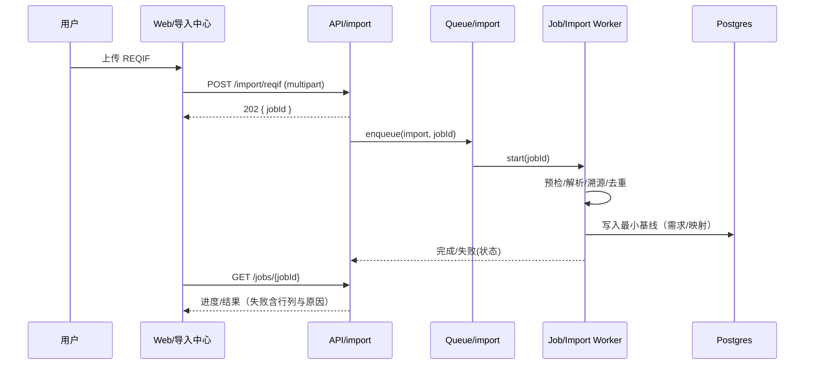
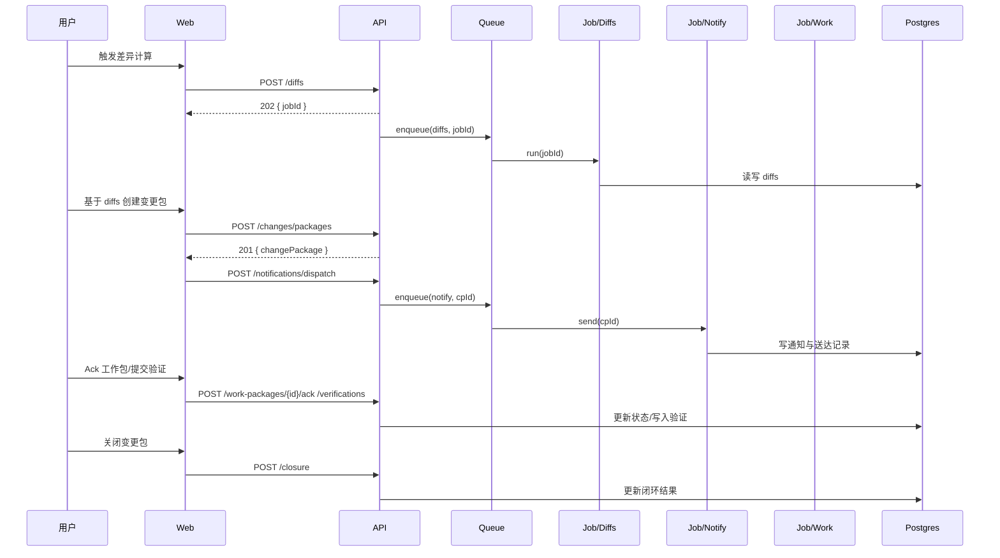
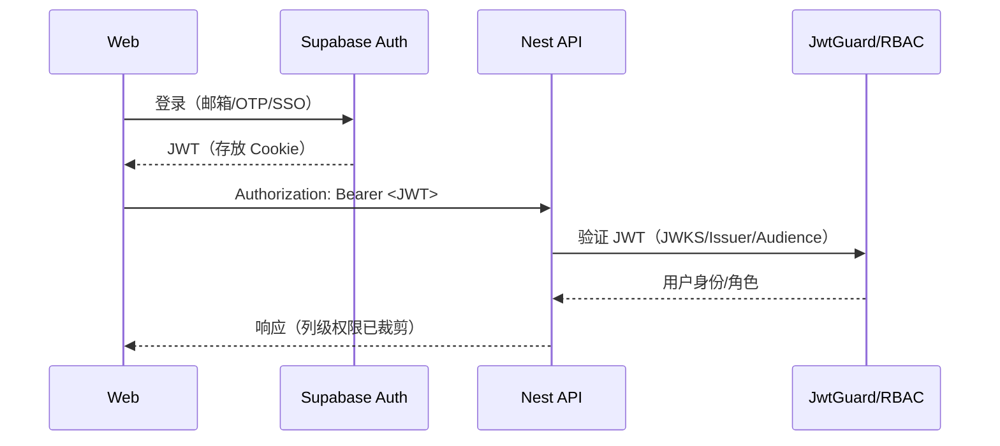
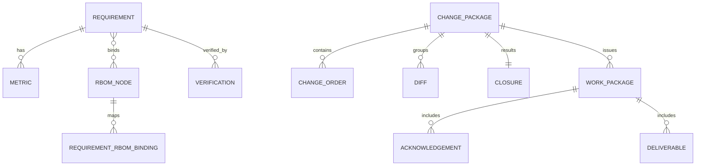
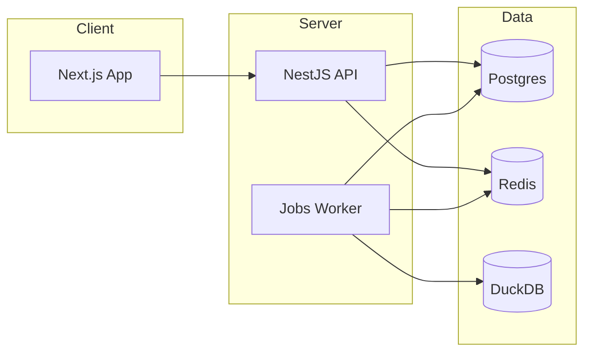

# CDM 需求集成 MVP 全栈架构文档

## 引言（Introduction）
本文件为 CDM 需求集成 MVP 的全栈架构说明，覆盖后端系统、前端实现及两者间的集成契约，作为 AI 驱动开发的唯一可信来源，确保技术栈、模式与治理的一致性。

本文件将前后端架构合并为统一视图，适配现代全栈协作与契约先行的工程方式，减少割裂与重复沟通。

### 起始模板 / 既有项目
- 现状：仓库为文档优先（未存在 `apps/*`、`package.json` 等代码/工程文件）
- PRD 期望：Yarn 3 Workspaces Monorepo（Next.js 14 App Router + NestJS 10 + Prisma/Postgres + BullMQ/Redis）
- 决策：无外部 starter；按本文档推荐结构从零脚手架搭建；Monorepo 工具采用 Yarn 3 + Turborepo

### 变更日志（Change Log）
| 日期       | 版本 | 描述             | 作者    |
|------------|------|------------------|---------|
| 2025-09-22 | 1.1  | 安全/输入校验、熔断/扩缩容、测试与依赖策略增补 | Winston |
| 2025-09-22 | 0.1  | 初始创建（草案） | Winston |

---

## 高层架构（High Level Architecture）

### 技术摘要（Technical Summary）
- 架构风格：单体内模块化分层，Monorepo 多包协作；前端 Next.js SSR/ISR，后端 NestJS REST；长任务以 BullMQ 队列异步化
- 前后端：Next.js 14（App Router）+ Tailwind + shadcn/ui + TanStack Table；NestJS 10 + Prisma/Postgres + BullMQ/Redis + DuckDB（就地分析）
- 集成契约：Swagger/OpenAPI 生成类型与客户端；统一鉴权与错误模型；列级权限/导出治理在服务端强制
- 可观测：Pino + OpenTelemetry + Prometheus /metrics；CI 含 OpenAPI Lint & Diff、安全扫描
- PRD 对齐：以 DOORS→系统→指标→RBOM→差异→变更→通知→验证/回归 的最小闭环为主轴，强调可演示、可复核、可追溯

### 平台与基础设施（方案 A）
- 前端：Vercel（Next.js 部署、CDN/边缘缓存）
- 数据层：Supabase Postgres（主库）与对象存储（如需附件）
- 队列：Upstash Redis（Serverless 友好）
- API 与队列 Worker：Render/Railway 单容器部署（NestJS HTTP 服务 + 独立 Worker 进程）
- 理由：MVP 演示最快路径，全球可用，成本低；Worker 需常驻进程，因此放置于 Render/Railway 更稳妥

### 仓库结构（Monorepo）
- Structure: Monorepo（apps + packages）
- Monorepo Tool: Yarn 3 Workspaces + Turborepo（任务编排与缓存）
- Package Organization：
  - `apps/web`：Next.js 14
  - `apps/api`：NestJS 10（HTTP 服务）
  - `apps/worker`：BullMQ 队列 Worker（独立进程）
  - `packages/shared`：共享类型/常量/工具
  - `packages/config`：ESLint/TSConfig/Prettier/commitlint 等共享配置
  - `infrastructure/`：部署脚本/IaC（可后续补充）

### 高层架构图
```mermaid
graph LR
  U[用户/浏览器] --> W[Next.js 14@Vercel<br/>SSR/ISR+CDN]
  W -->|OpenAPI 客户端| A[NestJS 10 REST API<br/>Render/Railway]
  subgraph Backend (Render/Railway)
    A --> P[(Supabase Postgres)]
    A --> R[(Upstash Redis)]
    A --> D[(DuckDB)]
    A --> J[Jobs/BullMQ<br/>导入/抽取/差异/通知]
    J --> R
    J --> P
  end
  subgraph Integrations
    J --> DOORS[DOORS 适配器<br/>Mock/Real 切换]
    J --> NOTI[通知适配器<br/>站内信/OA]
  end
  subgraph Observability
    A --> M[/metrics/ Prometheus]
    A --> O[OpenAPI /__openapi.json]
    A --> L[Pino+OTEL 日志/追踪]
  end
```

### 架构与设计模式（已选）
- 契约先行（OpenAPI 生成类型/客户端）
- Repository + Service 分层
- 队列驱动异步流水线（BullMQ）
- 环境集中校验（dotenv-safe/envalid）
- 统一错误模型/拦截器
- 服务端列级权限/导出治理（审批/水印/脱敏/审计）

---

## 技术栈（Tech Stack）

| 类别 | 技术 | 版本 | 用途 | 选型理由 |
|---|---|---|---|---|
| 前端语言 | TypeScript | 5.4.x | 统一类型 | 生态成熟，与 Next/Nest 兼容 |
| 前端框架 | Next.js + React | 14.2.x / 18.2.x | SSR/ISR | PRD 指定，Vercel 适配最佳 |
| UI 组件库 | shadcn/ui（Radix） | 1.x | A11y 组件 | 与 Tailwind 搭配、按需引入 |
| CSS 框架 | Tailwind CSS | 3.4.x | 样式 | 原子化高效、配套完善 |
| 状态管理 | TanStack Query + Zustand | 5.x / 4.x | 数据/本地状态 | 数据密集、避免过度全局状态 |
| 后端语言 | TypeScript | 5.4.x | 一致性 | 前后端共享类型 |
| 后端框架 | NestJS | 10.3.x | REST API | 模块化、可测试性强 |
| API 风格 | OpenAPI 3.0（REST） | - | 契约/生成 | 契约先行，前后端一致 |
| 数据库 | PostgreSQL（Supabase） | 15.x | 业务与元模型 | JSONB/GIN，托管省运维 |
| 队列/缓存 | BullMQ + Redis（Upstash） | 4.x / 托管 | 长任务 | Serverless 友好，成熟生态 |
| 存储 | Supabase Storage | - | 附件/导出 | 与 Auth/DB 一体化 |
| 鉴权 | Supabase Auth | 2.x | 身份/JWT | MVP 快速落地，可后续替换 |
| 前端测试 | Vitest + Testing Library | 1.5.x / 14.x | 单元/组件 | 速度快，生态广 |
| 后端测试 | Jest + supertest | 29.7.x / 6.3.x | 单元/集成 | Nest 生态完善 |
| E2E 测试 | Playwright | 1.45.x | 端到端 | 跨浏览器稳定，CI 友好 |
| 构建编排 | Turborepo + Yarn 3 | 1.12.x / 3.6.x | Monorepo | 缓存与任务编排 |
| 打包 | Next 内置 / tsup | - / 7.3.x | 应用/库 | 与 Next 兼容；库构建轻量 |
| CI/CD | GitHub Actions | - | 流水线 | 与 ci-security 文档对齐 |
| 监控 | OpenTelemetry + Prometheus | - | 指标/追踪 | 契约/观测目标一致 |
| 日志 | pino | 8.x | 结构化 | 低开销，字段化日志 |

> 版本锁定策略：初始化脚手架时固定至具体补丁版并生成锁文件；OpenAPI/Prisma/OTEL 等子包按兼容矩阵精确锁定。

---

## 工程与工具链落地（结合高收益与相容增强）

### 版本与环境
- Node 固定：Volta 固定 Node 20.14.0；同时提供 `.nvmrc`
- 包管理：Yarn 3（Berry）+ Workspaces，安装使用 `yarn install --immutable`
- Registry 建议：本地可用镜像（如 npmmirror），CI 使用官方 registry 并开启完整性校验

### Monorepo 与目录
- 工具：Yarn Workspaces + Turborepo（任务编排与缓存）；不引入 Lerna（避免与 Changesets 职责重叠）
- 包结构（新增两个契约产物包）：
  - `apps/web`（Next.js 14）
  - `apps/api`（NestJS 10）
  - `apps/worker`（BullMQ 队列 Worker）
  - `packages/shared`（共享类型/常量/工具）
  - `packages/config`（ESLint/TSConfig/Prettier/commitlint 配置）
  - `packages/api-types`（由 OpenAPI 生成的 TS 类型）
  - `packages/api-client`（由 OpenAPI 生成的前端/服务端 API 客户端）
  - `infrastructure/`（部署脚本/IaC，可选）

### TypeScript 配置分层
- 根通用 `tsconfig.base.json`（严格模式）；`tsconfig.paths.json` 统一别名
- Server：`tsconfig.server.json`（Node 兼容，CommonJS 或逐步过渡 ESM）
- Client：`tsconfig.client.json`（React/DOM）

### 契约与 API 参考流水线
- 服务端导出：`GET /api/__openapi.json`（或 yaml）
- 生成脚本：
  - `api:types` → `packages/api-types/src/index.ts`
  - `api:client` → `packages/api-client`（axios 客户端）
- 规范：前端禁止手写 URL/类型，统一引用生成产物
- CI：Spectral Lint + 基线 Diff（对 `docs/openapi.baseline.json`）

### CI/CD 与质量门槛（强制）
- 必过步骤：`lint`、`prettier:check`、`type-check`、`test:web`、`test:api`、`build`、`api:openapi` + `api:spectral` + `api:diff`
- 提交规范：Conventional Commits + `commitlint`（type/scope 白名单），拒绝不合规提交
- 分支保护：`main/next/develop` 禁止直推，至少 1–2 Reviewer，所有状态检查通过才可合并
- 覆盖率：前后端分别产出覆盖率并在 CI 上传（或合并后上传）

### 测试策略
- 前端：Vitest + Testing Library；目录 `__tests__`
- 后端：Jest + supertest；目录 `__tests__`
- E2E：Playwright（手动工作流触发），产物：截图/trace，默认输出到 `storage/playwright`

### 可观测性与日志
- 日志：Pino（结构化 JSON）+ OpenTelemetry 上下文字段（`traceId/spanId/reqId`），禁止打印敏感信息
- 响应头：统一回传 `x-trace-id`
- 指标：Prometheus `/metrics`，采集 QPS/P95/P99/错误率/队列滞留/作业成功率
- Tracing：OTLP 默认导出（可接入 Tempo/Jaeger/New Relic 等）

### 容器与本地栈
- 镜像：多阶段构建（Builder/Runner），推荐 API/SSR 与静态服务分镜像
- 本地 Compose：Postgres、Redis、API、Worker（用于 E2E 与演示）

### 协作模板与检查单
- 引入 Issue/PR 模板与“一次性落地清单”，把“契约/日志/CI 门禁”列为必须项

---

## 组件与流程（Components & Workflows）

### 组件清单（职责与边界）

1) Web（Next.js 14）
- 模块：工作台/导入中心/需求/指标/RBOM/变更/回归/集成/审计/系统设置
- 服务层：统一使用 `packages/api-client`，错误与重试策略在拦截器实现
- 表格：TanStack Table（服务端分页/排序/过滤）；列级权限由服务端裁剪

2) API（NestJS 10）
- 层次：Controller（IO/DTO）→ Service（业务）→ Repository（Prisma）
- 模块：import、mapping、metrics-extraction、rbom-binding、diffs、changes、notifications、verifications、meta-requirements、exports
- 中间件/守卫：Auth（JWT/Supabase）、RBAC/列级权限、Error Filter、RequestId/Tracing

3) Jobs/Workers（BullMQ）
- 队列：`import`, `extract`, `diffs`, `notify`, `regression`, `export`
- 任务：REQIF/SRS 导入→预检/解析/溯源/预览/落库；指标抽取（规则/正则/词典/LLM）→复核→入库；差异生成；通知派发；回归批次构建；导出（治理：审批/水印/脱敏）

4) 适配器（Adapters）
- `doors-adapter`：REQIF 解析 + DXL 客户端（Mock/Real 可切换）
- `notifications-adapter`：站内信/OA 通知（合并、静默时间窗）

5) 存储与契约
- Postgres（Prisma）+ Redis（Upstash）+ DuckDB（临时/就地分析）+ Supabase Storage（附件/导出）
- OpenAPI 契约 `/api/__openapi.json` + 生成 `packages/api-types`/`api-client`

6) 共享包
- `packages/shared`：类型/常量/工具；`packages/config`：工程规范与配置

### 关键接口（Key Interfaces）
- Web ↔ API：通过生成客户端调用（统一错误模型/分页/筛选/排序约定）
- API ↔ Jobs：服务内发布任务到队列，幂等 + 超时/重试 + 死信策略
- Jobs ↔ 适配器：抽象接口 + Mock/Real 双实现，配置开关与熔断
- 导出治理：服务端列级权限、审批阈值（>5k）、水印/脱敏、审计日志

### 组件关系图（Mermaid）
```mermaid
graph TB
  subgraph Web
    W1[导入中心]
    W2[需求/指标/RBOM]
    W3[变更/回归]
    W4[集成/审计/系统]
  end
  W1 -->|API Client| API[(REST API)]
  W2 -->|API Client| API
  W3 -->|API Client| API
  W4 -->|API Client| API

  subgraph Backend
    API --> SVC[Services]
    SVC --> Q[Queues(BullMQ)]
    SVC --> DB[(Postgres)]
    SVC --> RED[(Redis)]
    SVC --> DDB[(DuckDB)]
  end

  Q --> J1[Import]
  Q --> J2[Extract]
  Q --> J3[Diffs]
  Q --> J4[Notify]
  Q --> J5[Regression]
  Q --> J6[Export]

  J1 --> AD1[DOORS 适配器]
  J4 --> AD2[通知适配器]

  API --> O11[OpenAPI]
  API --> M11[/metrics]
```

### 核心流程（序列图）

1) REQIF 导入最小闭环


2) 差异→变更→通知→Ack→验证→闭环


---

## 前端架构（Frontend Architecture）

### 组件组织（目录约定）
```text
apps/web/
├── app/                      # App Router
│   ├── (auth)/sign-in/page.tsx
│   ├── (dashboard)/page.tsx
│   ├── import/page.tsx
│   ├── requirements/page.tsx
│   ├── requirements/[id]/page.tsx
│   ├── diffs/page.tsx
│   ├── changes/page.tsx
│   ├── work-packages/page.tsx
│   ├── verifications/page.tsx
│   ├── layout.tsx
│   └── page.tsx
├── components/
│   ├── ui/                   # shadcn/ui 原子组件
│   └── shared/               # 复合组件（按域）
├── lib/
│   ├── api/                  # OpenAPI 客户端封装
│   ├── auth/
│   ├── store/                # Zustand stores
│   └── utils/
├── styles/
└── tests/
```

### 组件模板（示例）
```tsx
// apps/web/components/shared/ImportCard.tsx
import { useState } from 'react';
import { Button } from '@/components/ui/button';

type Props = { onUpload: (f: File) => Promise<void> };
export function ImportCard({ onUpload }: Props) {
  const [busy, setBusy] = useState(false);
  return (
    <div className="rounded-lg border p-4">
      <input type="file" accept=".reqif,.zip,.doc,.docx" onChange={async (e) => {
        const f = e.target.files?.[0];
        if (!f) return;
        setBusy(true);
        try { await onUpload(f); } finally { setBusy(false); }
      }} />
      <Button disabled={busy} className="ml-2">{busy ? '上传中…' : '选择文件'}</Button>
    </div>
  );
}
```

### 状态管理（TanStack Query + Zustand）
```ts
// apps/web/lib/store/import.ts
import { create } from 'zustand';

type ImportState = { jobId?: string; setJobId: (id?: string) => void };
export const useImportStore = create<ImportState>((set) => ({
  jobId: undefined,
  setJobId: (id) => set({ jobId: id }),
}));

// apps/web/lib/api/queryClient.ts
import { QueryClient } from '@tanstack/react-query';
export const queryClient = new QueryClient({
  defaultOptions: { queries: { staleTime: 60_000, retry: 2 } },
});
```

### 状态管理模式（约定）
- 查询统一走 Query；写操作成功后执行精确失效（invalidateQueries）
- Ack/导入进度等适用乐观更新；失败回滚
- 表格默认服务端分页/排序/过滤；超大列表开启虚拟化

### 路由与受保护页面
```text
apps/web/app/
├── (auth)/sign-in/page.tsx   # 公开
├── (protected)/layout.tsx    # 受保护路由组
└── (protected)/requirements/page.tsx
```
```ts
// apps/web/app/(protected)/layout.tsx
import { cookies } from 'next/headers';
import { redirect } from 'next/navigation';
export default async function ProtectedLayout({ children }: { children: React.ReactNode }) {
  const token = cookies().get('sb-access-token')?.value; // Supabase JWT（示例）
  if (!token) redirect('/sign-in');
  return <>{children}</>;
}
```

### 前端服务层（OpenAPI 客户端封装）
```ts
// apps/web/lib/api/client.ts
import { Api } from '@project/api-client'; // packages/api-client 生成产物
import { cookies } from 'next/headers';

export function serverApi() {
  const c = cookies();
  const token = c.get('sb-access-token')?.value;
  return new Api({
    baseURL: process.env.NEXT_PUBLIC_API_BASE,
    headers: token ? { Authorization: `Bearer ${token}` } : {},
  });
}

// 示例：发起导入
export async function startReqifImport(file: File) {
  const api = serverApi();
  const form = new FormData();
  form.append('file', file);
  const res = await api.import.reqifCreate(form);
  return res.jobId as string;
}
```

---

## 后端架构（Backend Architecture）

### 服务架构（NestJS · 传统服务）
```text
apps/api/src/
├── main.ts
├── app.module.ts
└── modules/
    ├── import/
    │   ├── import.module.ts
    │   ├── import.controller.ts
    │   ├── import.service.ts
    │   └── jobs/
    ├── diffs/
    ├── rbom/
    ├── changes/
    ├── notifications/
    ├── verifications/
    ├── meta/
    └── exports/
```

```ts
// apps/api/src/modules/import/import.controller.ts
import { Controller, Post, UploadedFile, UseInterceptors, HttpCode, HttpStatus } from '@nestjs/common';
import { FileInterceptor } from '@nestjs/platform-express';
import { ImportService } from './import.service';

@Controller('import')
export class ImportController {
  constructor(private readonly svc: ImportService) {}

  @Post('reqif')
  @UseInterceptors(FileInterceptor('file'))
  @HttpCode(HttpStatus.ACCEPTED)
  async importReqif(@UploadedFile() file: Express.Multer.File) {
    const jobId = await this.svc.enqueueReqif(file);
    return { jobId, status: 'queued' };
  }
}
```

### 数据库架构（Prisma 片段）
```prisma
// apps/api/prisma/schema.prisma（节选）
model Requirement {
  id              String   @id @default(cuid())
  moduleId        String
  objectId        String
  baselineId      String
  title           String
  content         String
  status          String   // draft/in_review/frozen/changing/closed
  priority        String   // P0/P1/P2/P3
  verificationMethod String?
  dedupeHash      String   @unique
  extras          Json?
  createdAt       DateTime @default(now())
  updatedAt       DateTime @updatedAt
  metrics         Metric[]
}

model Metric {
  id            String   @id @default(cuid())
  requirementId String
  name          String
  value         Float?
  unit          String?
  normalizedUnit String?
  lower         Float?
  lowerInc      Boolean?
  upper         Float?
  upperInc      Boolean?
  method        String
  confidence    Float?
  sourceFragment String?
  extras        Json?
  requirement   Requirement @relation(fields: [requirementId], references: [id])
}

model RbomNode {
  id        String  @id @default(cuid())
  code      String
  name      String
  level     Int
  parentId  String?
  path      String
  baselineId String?
  extras    Json?
}
```

### Repository 模式（示例）
```ts
// apps/api/src/modules/requirements/requirement.repository.ts
import { Injectable } from '@nestjs/common';
import { PrismaService } from '../../shared/prisma.service';

@Injectable()
export class RequirementRepository {
  constructor(private prisma: PrismaService) {}
  findPage(params: { page: number; pageSize: number; status?: string }) {
    const { page, pageSize, status } = params;
    return this.prisma.requirement.findMany({
      where: { status },
      skip: (page - 1) * pageSize,
      take: pageSize,
      orderBy: { updatedAt: 'desc' },
    });
  }
}
```

### 鉴权与授权（Supabase JWT + 守卫）


```ts
// apps/api/src/shared/guards/supabase-jwt.guard.ts（示意）
import { CanActivate, ExecutionContext, Injectable, UnauthorizedException } from '@nestjs/common';
import { createRemoteJWKSet, jwtVerify } from 'jose';

@Injectable()
export class SupabaseJwtGuard implements CanActivate {
  private jwks = createRemoteJWKSet(new URL(process.env.SUPABASE_JWKS_URL!));
  async canActivate(ctx: ExecutionContext) {
    const req = ctx.switchToHttp().getRequest();
    const auth = req.headers['authorization'] as string | undefined;
    const token = auth?.startsWith('Bearer ') ? auth.slice(7) : undefined;
    if (!token) throw new UnauthorizedException('Missing token');
    const { payload } = await jwtVerify(token, this.jwks, {
      issuer: process.env.SUPABASE_ISSUER,
      audience: process.env.SUPABASE_AUD,
    });
    req.user = { sub: payload.sub, roles: payload['roles'] };
    return true;
  }
}
```

### 列级权限与导出治理（约定）
- 所有查询在服务端依据角色裁剪字段；导出与查询复用同一权限检查
- `>5k` 行导出进入审批流程（异步 Job），生成带水印文件与审计记录

---

## 开发与运行流程（Development Workflow）

### 前置环境与初始化
```bash
# 固定 Node 版本并启用 Corepack（Yarn 3）
curl https://get.volta.sh | bash
volta install node@20.14.0
corepack enable

# 安装依赖（严格锁定）
yarn --version
yarn install --immutable

# 本地依赖栈（如需）：Postgres/Redis
#（建议提供 docker-compose.dev.yml）
docker compose -f docker-compose.dev.yml up -d postgres redis
```

### 常用脚本（建议在根 package.json 提供）
```json
{
  "scripts": {
    "dev": "turbo run dev --parallel",
    "dev:web": "turbo run dev --filter=web",
    "dev:api": "turbo run dev --filter=api",
    "build": "turbo run build",
    "lint": "eslint . --ext .ts,.tsx",
    "prettier:check": "prettier -c .",
    "prettier:write": "prettier -w .",
    "type-check": "tsc -b -v --pretty false",
    "test:web": "vitest run --dir apps/web",
    "test:api": "jest --config apps/api/jest.config.ts",
    "api:openapi": "node scripts/export-openapi.js",
    "api:spectral": "spectral lint docs/openapi.json",
    "api:diff": "openapi diff docs/openapi.baseline.json docs/openapi.json || true",
    "api:types": "openapi-typescript http://localhost:$APP_PORT/api/__openapi.json -o packages/api-types/src/index.ts",
    "api:client": "openapi-typescript-codegen --input http://localhost:$APP_PORT/api/__openapi.json --output packages/api-client --client axios --useOptions"
  }
}
```

### 本地开发流程
- 启动依赖（如使用 Compose）：`docker compose -f docker-compose.dev.yml up -d postgres redis`
- 启动应用：`yarn dev`（并行启动 web/api/worker）
- 变更 API 后：`yarn api:openapi && yarn api:spectral && yarn api:types && yarn api:client`
- 提交前：`yarn lint && yarn prettier:check && yarn type-check && yarn test:web && yarn test:api`

---

## 编码标准与命名约定（Coding Standards）

### 关键规则（Fullstack Critical Rules）
- 类型共享：公共类型统一放在 `packages/shared`，API 类型使用 `packages/api-types`
- 服务层：前端禁止直接手写 HTTP 调用，统一通过 `packages/api-client`
- 环境变量：仅通过集中配置读取，禁止随处访问 `process.env`
- 错误处理：后端必须使用统一异常过滤器；前端统一错误拦截与用户级提示映射
- 状态管理：查询用 TanStack Query；全局/页面局部状态用 Zustand；避免不必要的全局状态
- RBAC/列级权限：所有返回字段均经过服务端裁剪；导出与查询共享同一权限检查
- 迁移策略：Prisma Migrate 变更必须可回滚/幂等；高风险操作拆分执行
- 日志/追踪：所有入口记录 `traceId/reqId`；响应头回传 `x-trace-id`

### 命名建议（示例）
- 组件/文件：组件 `PascalCase`，变量/函数 `camelCase`，常量 `SCREAMING_SNAKE_CASE`
- API 路由：kebab-case（如 `/work-packages`）
- 数据库：snake_case 表名与字段名（Prisma 层统一映射）

---

## 统一错误处理（Error Handling）

### 前端错误模型与拦截
```ts
// apps/web/lib/api/errors.ts
export interface ApiError { error: { code: string; message: string; details?: Record<string, any>; timestamp: string; requestId: string; }; }

export function handleApiError(e: unknown): string {
  const any = e as any;
  if (any?.response?.data?.error?.message) return any.response.data.error.message as string;
  return '网络或系统异常，请稍后重试';
}
```

### 后端异常过滤器（NestJS）
```ts
// apps/api/src/shared/filters/http-exception.filter.ts
import { ArgumentsHost, Catch, ExceptionFilter, HttpException, HttpStatus } from '@nestjs/common';

@Catch()
export class AllExceptionsFilter implements ExceptionFilter {
  catch(exception: unknown, host: ArgumentsHost) {
    const ctx = host.switchToHttp();
    const res = ctx.getResponse();
    const req = ctx.getRequest();
    const status = exception instanceof HttpException ? exception.getStatus() : HttpStatus.INTERNAL_SERVER_ERROR;
    const message = exception instanceof HttpException ? (exception.getResponse() as any)?.message ?? exception.message : 'Internal Server Error';
    const requestId = req.headers['x-trace-id'] || req.id;
    res.status(status).json({ error: { code: String(status), message, timestamp: new Date().toISOString(), requestId } });
  }
}
```

---

## 测试与覆盖率（Testing & Coverage）
- 前端：Vitest + Testing Library；目录 `apps/web/__tests__`；快照仅用于稳定 UI
- 后端：Jest + supertest；目录 `apps/api/__tests__`；集成测试覆盖核心路由与错误路径
- E2E：Playwright（手动工作流触发），输出截图/trace；默认路径 `storage/playwright`
- 覆盖率：前后端分别产出覆盖率并在 CI 上传（或使用 nyc/istanbul 合并后上传）

---

## 监控与可观测性（Monitoring & Observability）

### 环境变量（示例）
```bash
# OpenTelemetry
OTEL_EXPORTER_OTLP_ENDPOINT=http://otel-collector:4317
OTEL_RESOURCE_ATTRIBUTES=service.name=cdm-api,service.version=0.1.0,service.namespace=cdm

# 日志
LOGGER_LEVEL=info
LOGGER_FORMAT=json

# Prometheus 指标（/metrics）
PROM_ENABLED=true
```

### 指标建议
- 应用：QPS、P95/99、错误率（4xx/5xx）、并发连接、任务滞留/重试次数
- 数据库：连接池利用率、慢查询计数/耗时分位数
- 作业：队列长度、成功/失败率、任务执行时长 P95/99

---

## 一次性落地清单（Checklist）
- [ ] `.editorconfig` 与 `.nvmrc` 提交，Volta/Node 固定
- [ ] CI 增加 `prettier:check`、`type-check`、前后端测试与覆盖率上传
- [ ] 提交门禁：commitlint（type/scope 白名单）与分支保护规则
- [ ] OpenAPI：`api:openapi`/`api:spectral`/`api:diff`/`api:types`/`api:client` 脚本与基线文件
- [ ] `packages/api-types` 与 `packages/api-client` 目录初始化
- [ ] E2E：提供 `docker-compose.dev.yml` 与 Playwright 手动工作流
- [ ] 日志/追踪：Pino + OTEL 中间件与 `x-trace-id` 回传

---

## 监控与检查清单结果（CI 自动化）

本节定义“契约/安全/观测”三类强制检查在 CI 中的自动化执行与报告产物约定。

### GitHub Actions 工作流（示例：.github/workflows/quality.yml）
```yml
name: Quality Gates
on:
  pull_request:
    branches: [main, next, develop]
  push:
    branches: [main, next, develop]
concurrency:
  group: quality-${{ github.ref }}
  cancel-in-progress: true

jobs:
  contracts:
    runs-on: ubuntu-latest
    steps:
      - uses: actions/checkout@v4
      - name: Setup Node & Corepack
        uses: actions/setup-node@v4
        with:
          node-version: '20'
          cache: 'yarn'
      - run: corepack enable
      - run: yarn install --immutable
      - name: Build API & export OpenAPI
        run: |
          yarn build || true  # 如需
          yarn api:openapi     # 生成 docs/openapi.json
      - name: Spectral lint
        run: npx @stoplight/spectral-cli lint docs/openapi.json --format sarif -o reports/spectral.sarif
      - name: OpenAPI diff (vs baseline)
        run: |
          if [ -f docs/openapi.baseline.json ]; then \
            npx @redocly/openapi-cli@latest diff docs/openapi.baseline.json docs/openapi.json > reports/openapi-diff.txt || true; \
          else \
            echo 'No baseline found' > reports/openapi-diff.txt; \
          fi
      - name: Generate Types & Client
        run: |
          yarn api:types
          yarn api:client
      - name: Upload contract artifacts
        uses: actions/upload-artifact@v4
        with:
          name: contracts
          path: |
            docs/openapi.json
            reports/spectral.sarif
            reports/openapi-diff.txt

  security:
    runs-on: ubuntu-latest
    steps:
      - uses: actions/checkout@v4
      - name: gitleaks scan
        uses: gitleaks/gitleaks-action@v2
        with:
          args: detect --no-git -v --report-path reports/gitleaks.sarif --format sarif
      - name: OSV scan (lockfile + workspace)
        uses: google/osv-scanner-action@v1
        with:
          scan-args: >-
            --lockfile=./yarn.lock
            --recursive .
      - name: Upload security artifacts
        uses: actions/upload-artifact@v4
        with:
          name: security
          path: reports/

  observability:
    runs-on: ubuntu-latest
    services:
      postgres:
        image: postgres:15
        env:
          POSTGRES_PASSWORD: postgres
        ports: ['5432:5432']
        options: >-
          --health-cmd "pg_isready -U postgres" --health-interval 10s --health-timeout 5s --health-retries 5
      redis:
        image: redis:7
        ports: ['6379:6379']
    steps:
      - uses: actions/checkout@v4
      - uses: actions/setup-node@v4
        with:
          node-version: '20'
          cache: 'yarn'
      - run: corepack enable
      - run: yarn install --immutable
      - name: Start API (background)
        run: |
          APP_PORT=4000 yarn dev:api &
          sleep 8
      - name: Check /metrics
        run: |
          curl -fsSL http://localhost:4000/metrics | tee metrics/snapshot.txt
      - name: Upload metrics snapshot
        uses: actions/upload-artifact@v4
        with:
          name: metrics
          path: metrics/snapshot.txt
```

### 报告产物与路径约定
- 契约类：`docs/openapi.json`、`reports/spectral.sarif`、`reports/openapi-diff.txt`
- 安全类：`reports/gitleaks.sarif`、（OSV 扫描标准输出保存为 `reports/osv.txt` 可选）
- 观测类：`metrics/snapshot.txt`（Prometheus 文本）

### 检查清单结果（最新一次 CI）
| 类别 | 项目 | 结果 | 备注 |
|---|---|---|---|
| 契约 | Spectral Lint | 待生成 | reports/spectral.sarif |
| 契约 | OpenAPI Diff | 待生成 | reports/openapi-diff.txt |
| 安全 | gitleaks | 待生成 | reports/gitleaks.sarif |
| 安全 | OSV-Scanner | 待生成 | reports/osv.txt（可选） |
| 观测 | /metrics 快照 | 待生成 | metrics/snapshot.txt |

---

## API 规范（REST + OpenAPI 3.0）

### 基本约定
- 基础路径：`/api`（可选版本前缀 `/api/v1`）
- 认证：`Authorization: Bearer <Supabase JWT>`；后端验证 JWKS/Issuer/Audience
- 追踪：可选传入 `x-trace-id`，服务端回传同名响应头
- 分页：`page`（默认 1），`pageSize`（默认 20，最大 200）
- 错误：统一结构 `{ error: { code, message, details?, timestamp, requestId } }`

### 主要端点（节选）
- `POST /import/reqif`：导入 REQIF（multipart，异步作业，返回 `{ jobId }`）
- `GET /requirements`：分页查询系统需求
- `GET /rbom/nodes`：查询 RBOM 节点（支持 `parentId`）
- `POST /rbom/bindings`：绑定需求与 RBOM 节点
- `POST /diffs` / `GET /diffs`：触发/查询差异
- `POST /changes/packages`：基于差异创建变更包
- `POST /notifications/dispatch`：派发通知（站内信/OA，可合并）
- `POST /work-packages/{id}/ack`：工作包确认
- `POST /verifications` / `POST /deliverables` / `POST /closure`：验证/交付物/闭环
- `GET /metrics`：Prometheus 指标文本

### 请求/响应示例（节选）
```bash
curl -H "Authorization: Bearer $TOKEN" -F file=@sample.reqif \
  -X POST https://api.example.com/api/import/reqif
# 202
{ "jobId": "job_abc123", "status": "queued" }
```

```bash
curl -H "Authorization: Bearer $TOKEN" \
  'https://api.example.com/api/requirements?page=1&pageSize=20&status=frozen'
# 200
{ "items": [{"id":"SR-001","title":"…"}], "page":1, "pageSize":20, "total":312 }
```

### 枚举码值与 i18n 映射（展示）
- Requirement.status：draft→草拟；in_review→评审中；frozen→冻结；changing→变更中；closed→关闭
- Requirement.verificationMethod：test→试验；analysis→分析；inspection→检验；demonstration→演示
- Diff.severity：high→高；medium→中；low→低
- ChangePackage.status：draft→草拟；in_progress→进行中；pending_verification→待验证；completed→完成；closed→关闭
- WorkPackage.status（建议）：issued→已下发；in_progress→进行中；done→完成；closed→关闭
- Acknowledgement.status：acknowledged→已确认；rejected→已拒绝
- Verification.outcome：passed→通过；failed→失败；blocked→阻塞
- Closure.result：passed→通过；partially_passed→部分通过；failed→失败

> 契约基线：详见 `docs/openapi.baseline.json`（CI 将对 `docs/openapi.json` 执行 Lint & Diff）。

---

## 数据模型与索引（Models & Indexing）

### ER 概览图


### 需求 Requirement
- 状态枚举：draft/in_review/frozen/changing/closed
- 溯源键：`(moduleId, objectId, baselineId)`（BTREE 索引）
- 去重键：`dedupeHash` 唯一索引（标题+内容规范化哈希）
- JSONB 拓展：`extras` 建立 GIN 索引于常用路径（如 `extras->'fields'`）

### 指标 Metric
- 外键：`requirementId`（BTREE 索引）
- 查询索引：`(name)`（BTREE），必要时增加 `(normalizedUnit)`
- 范围字段：`lower/upper` 支持区间检索（可选表达式索引）

### RBOM 节点 RbomNode
- 唯一：`(code, baselineId)` 唯一索引；层级路径 `path` BTREE
- 父子：`parentId` BTREE；常用查询可加 `(level, code)` 复合索引

### 绑定 RequirementRbomBinding
- 唯一：`(requirementId, rbomNodeId, baselineId)` 唯一索引（`baselineId` 允许 NULL）

### 差异/变更/通知/工作包（摘要）
- Diff：
  - type：added/modified/deleted；severity：high/medium/low
  - 索引：`severity`、`targetType`、`changePackageId`
- ChangePackage/ChangeOrder：
  - ChangePackage.status：draft/in_progress/pending_verification/completed/closed
  - 索引：ChangePackage(`ownerId`,`status`)、ChangeOrder(`assigneeId`,`status`)
- Notification：`recipientUserId/recipientRole/sentAt` 索引
- WorkPackage/Acknowledgement：
  - WorkPackage.status：issued/in_progress/done/closed；Acknowledgement.status：acknowledged/rejected
  - 索引：WorkPackage(`assigneeId`,`status`)

### 审计 AuditLog
- 时间序：`when DESC` BTREE；`(viewId, traceId)` 复合；必要时对 payload 建 GIN

### 其他（配置与元模型）
- Lookup：`domain` 索引（存放枚举/词典映射）
- MetaRequirementField：`(module, key)` 唯一；`module` 索引（需求实体的动态字段定义）

### 保留与归档（建议）
- 审计与导出记录 ≥ 1 年；指标抽取中间态 90 天；作业日志 30–90 天（分层存储）

---

## 权限与治理矩阵（RBAC/ABAC & Export Governance）

### 角色（建议）
- Admin：全资源管理；可配置治理策略
- Configurator：元模型/规则/视图配置（仅“需求实体”）
- Engineer：需求/指标/RBOM 绑定与变更操作
- QA：验证/回归/看板与关闭
- Viewer：只读（遵循列级权限）

### 资源→动作（示例）
- Requirements：read（所有）；write（Engineer/Admin）；delete（仅本地新增，DOORS 同步项禁止）
- Metrics：read；write（抽取/复核后入库）；delete（管理员）
- RBOM Bindings：read/write（Engineer/QA/Admin）
- Diffs/Changes：read；write（Engineer/Admin）
- Notifications：dispatch（Admin/Engineer）
- Exports：read（受治理与审批）；生成走异步 Job

### 列级权限
- 未授权字段不返回（而非空字符串）
- 导出与查询共享同一权限检查

### 导出治理
- 阈值：`> 5000` 行需审批；异步生成，带水印与审计
- 脱敏：遮蔽/哈希/分档/置空；默认拒绝，按字段白名单开放

### 策略表达与执行（Policy Enforcement）
- 策略存储（建议表结构）：
  - `policies`：`id, role, resource, effect(allow|deny), columns(jsonb), createdAt`
  - `export_policies`：`id, role, resource, thresholdRows, watermark(jsonb), masking(jsonb), approvals(jsonb)`
- 执行位置：
  - 读路径：Controller → Guard(`ColumnProjectionGuard`) 根据 `role+resource` 计算列白名单，注入到 Service 查询的 select/projection
  - 写路径：Guard(`ActionGuard`) 校验 `role→resource→action`
  - 导出：同一策略表生效；由 ExportService 合并“列白名单 + 脱敏规则 + 水印模板 + 阈值审批”
- 伪代码（列裁剪）：
```ts
// ColumnProjectionGuard.ts
const policy = await policyRepo.getColumns(role, resource);
req.projection = policy.columns; // ['id','title','priority',...]
await next();

// Service 查询
this.prisma.requirement.findMany({ select: projectionToSelect(req.projection), ...filters });
```
- 伪代码（导出治理）：
```ts
const p = await exportPolicyRepo.get(role, resource);
if (rowCount > p.thresholdRows) enqueueApproval();
const rows = maskColumns(data, p.masking);
const file = addWatermark(csv(rows), p.watermark);
auditLog('export', { viewId, traceId, count: rows.length });
```

---

## NFR/SLO 与告警（性能/可靠性/可用性）

### 目标（初版）
- API：GET P95 ≤ 300ms、P99 ≤ 800ms；写操作 P95 ≤ 800ms
- 作业：导入/抽取/差异 Job 启动延迟 P95 ≤ 1s；处理时长按批量规模约束并报出 ETA
- 队列：滞留时间 P95 ≤ 10s；失败率 ≤ 1%（自动重试 3 次）
- 可用性：月度 API 可用性 ≥ 99.5%

### 告警建议
- 错误率 > 2%（5 分钟窗口）
- API 延迟 P95 > 800ms（连续 5 个窗口）
- 队列滞留 > 60s 或 DLQ 积压
- 导出任务 > 阈值（并发/时长）

---

## 安全与合规（Security & Compliance）

### 威胁建模（简表）
- STRIDE：
  - S 伪装：JWT 校验（Issuer/Aud/JWKS）
  - T 篡改：签名校验/审计链/只读字段保护
  - R 抗抵赖：导出水印/审计日志
  - I 信息泄露：列级权限/脱敏/最小化返回
  - D 拒绝服务：速率限制/导出限流/队列背压
  - E 权限提升：RBAC/审批流/最小权限策略

### 凭证/密钥
- `.env` 通过 `dotenv-safe/envalid` 校验；密钥不入库
- CI 使用密文注入；限制对外部 registry 的全局覆盖

### 备份/恢复
- 数据库每日全量、每小时增量（RPO ≤ 1h；RTO ≤ 4h）
- 导出文件/附件对象存储版本化

---

## 安全与输入校验增补（v1.1）

### 后端输入验证（DTO + 全局管道）
```ts
// apps/api/src/main.ts（示例）
import { ValidationPipe } from '@nestjs/common';
import { NestFactory } from '@nestjs/core';
import { AppModule } from './app.module';

async function bootstrap() {
  const app = await NestFactory.create(AppModule);
  app.useGlobalPipes(new ValidationPipe({ whitelist: true, forbidNonWhitelisted: true, transform: true }));
  await app.listen(process.env.APP_PORT || 4000);
}
bootstrap();
```

### CORS 与 CSRF 策略
- 默认使用 Bearer（Authorization 头）：关闭 Cookie 依赖，避免 CSRF；开启严格 CORS（origin allowlist + headers/credentials 控制）
```ts
// CORS（示例）
app.enableCors({
  origin: [/^https:\/\/.*\.example\.com$/, 'http://localhost:3000'],
  methods: ['GET','POST','PUT','PATCH','DELETE','OPTIONS'],
  allowedHeaders: ['Authorization','Content-Type','x-trace-id'],
  credentials: false,
});
```
- 若使用 Cookie（如 Supabase Auth 存 Cookie）：采用 SameSite=strict/lax + 双提交/自定义 header CSRF token；跨站仅通过受控跳转

### 共享 Schema（可选）
在 `packages/shared` 使用 Zod 描述公共入参/出参，服务端在 DTO 校验前做 schema 校验，前端用于表单/请求本地校验。

### 传输与存储加密
- 传输：全站 TLS；外呼 DOORS/OA 均使用 HTTPS，拒绝明文
- 数据库：Prisma 连接字符串开启 SSL，例如 `?sslmode=require`；托管 PG 配置 `PGSSLMODE=require`
- Redis：Upstash 默认 TLS；本地开发可禁用，生产必须启用
- 对象存储（Supabase Storage）：加密 at-rest；下载使用“签名 URL + 有效期”
```ts
// 签名 URL（示例）
const { data } = await supabase.storage.from('exports').createSignedUrl('cp_1/report.csv', 60);
```

### 日志脱敏（pino.redact 示例）
```ts
import pino from 'pino';
export const logger = pino({
  level: process.env.LOGGER_LEVEL ?? 'info',
  redact: {
    paths: ['req.headers.authorization','user.token','password','secret','body.password'],
    censor: '[REDACTED]'
  }
});
```

---

## 熔断与扩缩容增补（v1.1）

### 熔断/降级（DOORS/OA 适配器）
```ts
import CircuitBreaker from 'opossum';
const doorsCall = (payload: any) => http.post(DOORS_URL, payload, { timeout: 5000 });
const breaker = new CircuitBreaker(doorsCall, { timeout: 6000, errorThresholdPercentage: 50, volumeThreshold: 10, resetTimeout: 30000 });
breaker.fallback(() => ({ ok: false, reason: 'degraded', ticket: createOfflineTicket() }));
```
触发条件：错误率≥50% 或超时；恢复：30s 后半开；降级：转离线工单/缓存结果，告警并提示重试窗口。

### 负载均衡与扩缩容触发
- 健康检查：`/api/__health_check` 返回 200 与版本/时区
- 触发阈值（示例）：
  - API CPU > 70% 持续 5 分钟 或 P95 > 800ms
  - 队列滞留 > 60s 或 backlog > 1000（按队列）
- Render/Railway：开启自动扩缩，min=1，max=5；K8s 可使用 HPA（CPU/自定义指标）

---

## 测试与门禁增补（v1.1）

### 性能测试（k6 示例）
```js
// perf/import.js
import http from 'k6/http';
import { sleep } from 'k6';
export const options = { vus: 10, duration: '1m' };
export default function() {
  const res = http.get(`${__ENV.API_BASE}/requirements?page=1&pageSize=20`);
  if (res.status !== 200) { throw new Error('non-200'); }
  sleep(1);
}
```

### 安全测试（ZAP/Snyk 占位）
- ZAP: PR 触发轻量主动扫描（忽略已知低危规则），产出 HTML/JSON 报告
- Snyk/OSV：依赖与容器镜像扫描，超时降级为警告但不得忽略高危

### A11y 自动化建议
- eslint-plugin-jsx-a11y、axe-core/axe-playwright；对关键页面执行 a11y 检查并产出报告

---

## 依赖升级与三方频控增补（v1.1）

### 升级节奏与 OSV 修复 SLA
| 类别 | 节奏 | SLA |
|---|---|---|
| 小版本/补丁 | 每月巡检一次 | 高危 72h 内修复；中危 2 周；低危 1 个月 |
| 大版本 | 每季度评估 | 评估兼容性与回滚计划 |

### 三方接口频控（默认）
| 适配器 | 速率 | 超时 | 重试 | 回退 |
|---|---:|---:|---:|---|
| DOORS | 10 rps | 5s | 3（指数退避） | 熔断 30s，离线工单 |
| OA/站内信 | 20 rps | 3s | 2（固定间隔） | 队列缓冲+合并 |


## 部署拓扑（Deployment Topology · 方案 A）

```mermaid
graph LR
  User((用户)) --> V[Vercel Next.js]
  V -->|HTTPS| API[(Render/Railway Nest API)]
  API -->|SQL| PG[(Supabase Postgres)]
  API -->|TLS| RED[(Upstash Redis)]
  API -->|HTTP| W[Worker(队列消费)]
  W --> PG
  W --> RED
  W --> AD1[DOORS 适配器]
  W --> AD2[通知适配器]
  API --> METRICS[/metrics/]
  API --> OPENAPI[OpenAPI]
```

环境：生产/预发/开发多环境隔离；区域与现有基础设施一致。

---

## 迁移与回滚（Migrations & Rollback）

### 策略
- Prisma Migrate：变更可回滚/幂等；拆分高风险 DDL 与数据修复
- 预检：影子数据库/基线校验；变更模拟与耗时评估
- 备份：迁移前创建快照；必要时表级回滚剧本

### 流程
1) 变更 PR → 代码审查（含迁移文件）
2) CI：应用迁移到临时数据库并跑集成测试
3) 预发演练 → 生产窗口执行 → 验证/回滚预案

---

## 架构决策记录（ADR 指南）

### 位置与命名
- `docs/architecture/adr-YYYYMMDD-<slug>.md`

### 模板
```md
# 决策：<标题>
日期：YYYY-MM-DD
背景：<问题与约束>
选项：<A/B/C>
决策：<选定方案及理由>
影响：<对代码/流程/成本/风险的影响>
回退：<若撤销时的路径>
```

---

## C4 视图（C4 Views）

### 系统上下文图（Context）
```mermaid
graph TD
  User(用户) --> Web[CDM Web (Next.js)]
  Web --> API[CDM API (NestJS)]
  API --> DOORS[DOORS 系统]
  API --> OA[OA/站内信]
  API --> DB[(Postgres)]
  API --> REDIS[(Redis)]
```

### 容器图（Container）


---

## 配置与密钥管理（Configuration & Secrets）
- 配置来源：`.env`（dotenv-safe/envalid 校验）→ 进程环境变量 → 只读配置对象
- 命名规范：`APP_*` 应用、`DB_*` 数据库、`REDIS_*` 队列、`EXPORT_*` 导出治理、`OTEL_*` 观测
- 秘密管理：生产环境建议使用托管密钥服务或 Vault；严禁将密钥写入代码/镜像
- 多环境：`dev/staging/prod` 独立 `.env`，CI 仅注入需要的公开变量

---

## 缓存与限流（Caching & Rate Limiting）
- API 限流：按用户/IP 令牌桶（示例：`100 req/min`，突发 `200`），关键写路径更严格
- 服务端缓存：查询热点页 30–120s；RBOM 路径/模块树缓存并带失效
- 队列背压：作业并发按队列维度限流（如导出 2、导入 4、差异 4），超额排队

---

## 队列与可靠性策略（Queues & Reliability）
- BullMQ 通用配置：`attempts=3`、`backoff=exponential(1000ms)`、`timeout` 按任务设定
- DLQ：失败进入死信队列并告警；提供“重放”脚本
- 幂等：作业 `idempotencyKey` = 输入摘要；重复提交直接返回上次结果
- 去重：同一来源文件+基线哈希在导入阶段直接拒绝或转为覆盖策略

---

## 失败模式与恢复（Failure Modes & Resilience）
- DOORS 端不可达：适配器快速失败 + 指数退避；提供“离线文件导入”回路
- 数据库抖动：连接池限流 + 快速失败 + 读降级（只读页面提示）
- Redis 故障：写入型作业暂停并告警；读路径不依赖 Redis 的功能保持可用
- 导出超时：转后台并通知，生成后站内信告知下载链接

---

## 环境矩阵（Environments Matrix）
| 环境 | 域名 | 数据库 | Redis | 说明 |
|---|---|---|---|---|
| dev | localhost | 本地/容器 | 本地/容器 | 开发联调 |
| staging | stg.example.com | 托管 PG（小规格） | 托管 Redis | 预发验证 |
| prod | api.example.com | 托管 PG（生产） | 托管 Redis | 生产流量 |

---

## 发布策略（Release Strategy）
- Vercel：预览环境→主环境；Render/Railway：分环境+健康检查；启用金丝雀/回滚剧本
- 特性开关：导出治理/视图审批等敏感能力受开关控制；默认为关闭，逐步放开

---

## 成本与容量（Cost & Capacity）
- 估算输入：REQIF 文件大小/频次、需求/指标规模、导出行数分布、并发用户
- 初期建议：PG 中小规格 + Redis 基础规格；监控增长率并每周回顾

---

## i18n 与无障碍（i18n & A11y 摘要）
- i18n：采用 `en-US/zh-CN` 双语资源（参考 `docs/samples/i18n/*`），日期/数字本地化
- A11y：遵循 `docs/front-end-spec.md`（键盘可达、对比度、焦点管理、ARIA）

---

## 可追溯性矩阵（Traceability）
| PRD 功能 | 模块/端点 | 数据模型 | 备注 |
|---|---|---|---|
| REQIF 导入 | POST /import/reqif | Requirement/Metric | 作业化、预检/溯源/去重 |
| 指标抽取 | queue:extract、/metrics（API） | Metric | 规则/词典/LLM + 复核 |
| RBOM 绑定 | POST /rbom/bindings | RequirementRbomBinding/RbomNode | 基线化 |
| 差异/变更 | POST/GET /diffs, /changes/packages | Diff/Change* | 驱动通知与回归 |
| 通知/Ack | /notifications/dispatch, /work-packages/* | Notification/WorkPackage | 合并/送达/确认 |
| 验证/闭环 | /verifications, /closure | Verification/Closure | 看板聚合 |

---

## 路线图与里程碑（Roadmap & Milestones）
- 按 `docs/stories` 的 Epic 1–7 推进；每个 Epic 输出演示与样本数据
- 里程碑基线：完成端到端闭环演示、契约/观测门禁、导出治理最小实现

---

## 术语与词汇表（Glossary）
- REQIF：Requirements Interchange Format
- RBOM：Requirements Bill of Materials（本项目聚焦 Part 级）
- Baseline：版本冻结的最小集合
- Ack：接收确认

---

## 附录 A：.env.example（示例）
```env
APP_ENV=dev
APP_PORT=4000
API_BASE_URL=http://localhost:4000/api

DB_HOST=localhost
DB_PORT=5432
DB_USER=postgres
DB_PASSWORD=postgres
DB_NAME=cdm

REDIS_URL=redis://localhost:6379

EXPORT_WATERMARK=on
EXPORT_LIMIT_DEFAULT=5000
EXPORT_RATE_LIMIT=3/day

SUPABASE_JWKS_URL=https://YOUR-SUPABASE-PROJ.auth.supabase.com/.well-known/jwks.json
SUPABASE_ISSUER=https://YOUR-SUPABASE-PROJ.auth.supabase.com/
SUPABASE_AUD=authenticated

OTEL_EXPORTER_OTLP_ENDPOINT=http://localhost:4317
LOGGER_LEVEL=info
LOGGER_FORMAT=json
```

---

## 附录 B：导出治理配置（示例）
```yaml
export:
  threshold_rows: 5000
  approvals:
    required: true
    reviewers: ['data-admin','security']
  watermark:
    enabled: true
    fields: ['user','timestamp','viewId','traceId','filters']
  masking:
    ownerEmail: { type: mask, keepHead: 3, keepTail: 2, char: '*' }
    supplierName: { type: hash, algo: sha256 }
    costEstimate: { type: bucket, ranges: ['1-5','6-10','>10'] }
```

---

## 开放问题与假设（Open Questions & Assumptions）
- Supabase Auth 是否作为长期方案？若切换自研 RBAC 的迁移路径？
- LLM 抽取的模型与配额策略？错误率与人工复核阈值？
- OA/站内信对接的真实端点（URL/鉴权/频控）？
