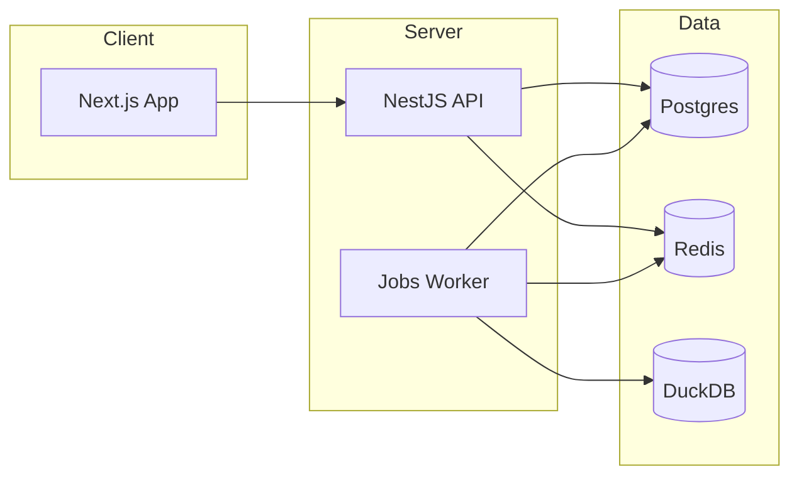

# C4 视图（C4 Views）

## 系统上下文图（Context）
```mermaid
graph TD
  User(用户) --> Web[CDM Web (Next.js)]
  Web --> API[CDM API (NestJS)]
  API --> DOORS[DOORS 系统]
  API --> OA[OA/站内信]
  API --> DB[(Postgres)]
  API --> REDIS[(Redis)]
```

## 容器图（Container）


---
