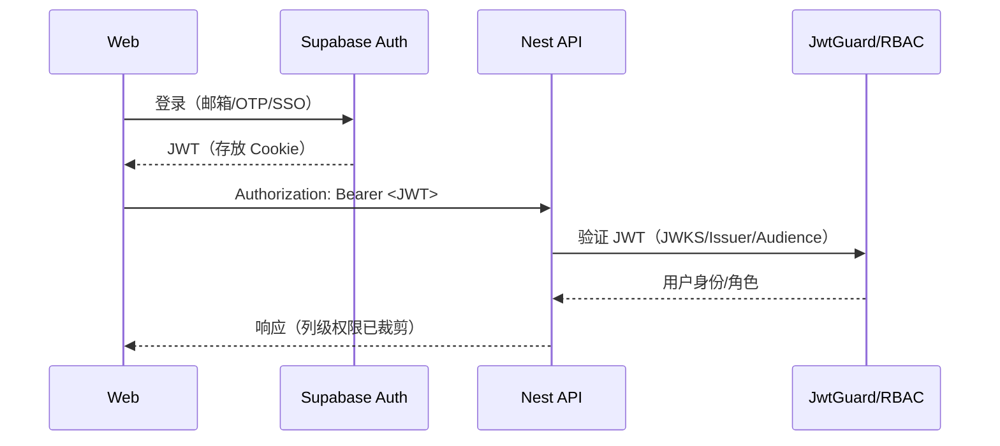

# 后端架构（Backend Architecture）

## 服务架构（NestJS · 传统服务）
```text
apps/api/src/
├── main.ts
├── app.module.ts
└── modules/
    ├── import/
    │   ├── import.module.ts
    │   ├── import.controller.ts
    │   ├── import.service.ts
    │   └── jobs/
    ├── diffs/
    ├── rbom/
    ├── changes/
    ├── notifications/
    ├── verifications/
    ├── meta/
    └── exports/
```

```ts
// apps/api/src/modules/import/import.controller.ts
import { Controller, Post, UploadedFile, UseInterceptors, HttpCode, HttpStatus } from '@nestjs/common';
import { FileInterceptor } from '@nestjs/platform-express';
import { ImportService } from './import.service';

@Controller('import')
export class ImportController {
  constructor(private readonly svc: ImportService) {}

  @Post('reqif')
  @UseInterceptors(FileInterceptor('file'))
  @HttpCode(HttpStatus.ACCEPTED)
  async importReqif(@UploadedFile() file: Express.Multer.File) {
    const jobId = await this.svc.enqueueReqif(file);
    return { jobId, status: 'queued' };
  }
}
```

## 数据库架构（Prisma 片段）
```prisma
// apps/api/prisma/schema.prisma（节选）
model Requirement {
  id              String   @id @default(cuid())
  moduleId        String
  objectId        String
  baselineId      String
  title           String
  content         String
  status          String   // draft/in_review/frozen/changing/closed
  priority        String   // P0/P1/P2/P3
  verificationMethod String?
  dedupeHash      String   @unique
  extras          Json?
  createdAt       DateTime @default(now())
  updatedAt       DateTime @updatedAt
  metrics         Metric[]
}

model Metric {
  id            String   @id @default(cuid())
  requirementId String
  name          String
  value         Float?
  unit          String?
  normalizedUnit String?
  lower         Float?
  lowerInc      Boolean?
  upper         Float?
  upperInc      Boolean?
  method        String
  confidence    Float?
  sourceFragment String?
  extras        Json?
  requirement   Requirement @relation(fields: [requirementId], references: [id])
}

model RbomNode {
  id        String  @id @default(cuid())
  code      String
  name      String
  level     Int
  parentId  String?
  path      String
  baselineId String?
  extras    Json?
}
```

## Repository 模式（示例）
```ts
// apps/api/src/modules/requirements/requirement.repository.ts
import { Injectable } from '@nestjs/common';
import { PrismaService } from '../../shared/prisma.service';

@Injectable()
export class RequirementRepository {
  constructor(private prisma: PrismaService) {}
  findPage(params: { page: number; pageSize: number; status?: string }) {
    const { page, pageSize, status } = params;
    return this.prisma.requirement.findMany({
      where: { status },
      skip: (page - 1) * pageSize,
      take: pageSize,
      orderBy: { updatedAt: 'desc' },
    });
  }
}
```

## 鉴权与授权（Supabase JWT + 守卫）


```ts
// apps/api/src/shared/guards/supabase-jwt.guard.ts（示意）
import { CanActivate, ExecutionContext, Injectable, UnauthorizedException } from '@nestjs/common';
import { createRemoteJWKSet, jwtVerify } from 'jose';

@Injectable()
export class SupabaseJwtGuard implements CanActivate {
  private jwks = createRemoteJWKSet(new URL(process.env.SUPABASE_JWKS_URL!));
  async canActivate(ctx: ExecutionContext) {
    const req = ctx.switchToHttp().getRequest();
    const auth = req.headers['authorization'] as string | undefined;
    const token = auth?.startsWith('Bearer ') ? auth.slice(7) : undefined;
    if (!token) throw new UnauthorizedException('Missing token');
    const { payload } = await jwtVerify(token, this.jwks, {
      issuer: process.env.SUPABASE_ISSUER,
      audience: process.env.SUPABASE_AUD,
    });
    req.user = { sub: payload.sub, roles: payload['roles'] };
    return true;
  }
}
```

## 列级权限与导出治理（约定）
- 所有查询在服务端依据角色裁剪字段；导出与查询复用同一权限检查
- `>5k` 行导出进入审批流程（异步 Job），生成带水印文件与审计记录

---
