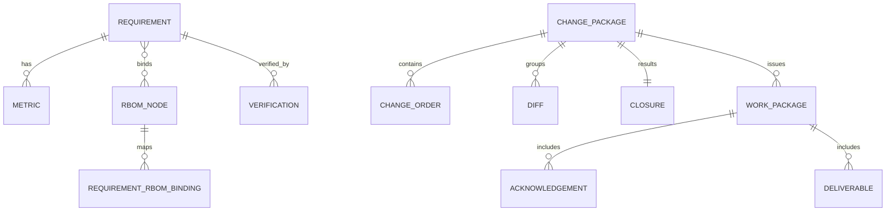

# 数据模型与索引（Models & Indexing）

## ER 概览图

## 需求 Requirement
- 状态枚举：draft/in_review/frozen/changing/closed
- 溯源键：`(moduleId, objectId, baselineId)`（BTREE 索引）
- 去重键：`dedupeHash` 唯一索引（标题+内容规范化哈希）
- JSONB 拓展：`extras` 建立 GIN 索引于常用路径（如 `extras->'fields'`）

## 指标 Metric
- 外键：`requirementId`（BTREE 索引）
- 查询索引：`(name)`（BTREE），必要时增加 `(normalizedUnit)`
- 范围字段：`lower/upper` 支持区间检索（可选表达式索引）

## RBOM 节点 RbomNode
- 唯一：`(code, baselineId)` 唯一索引；层级路径 `path` BTREE
- 父子：`parentId` BTREE；常用查询可加 `(level, code)` 复合索引

## 绑定 RequirementRbomBinding
- 唯一：`(requirementId, rbomNodeId, baselineId)` 唯一索引（`baselineId` 允许 NULL）

## 差异/变更/通知/工作包（摘要）
- Diff：
  - type：added/modified/deleted；severity：high/medium/low
  - 索引：`severity`、`targetType`、`changePackageId`
- ChangePackage/ChangeOrder：
  - ChangePackage.status：draft/in_progress/pending_verification/completed/closed
  - 索引：ChangePackage(`ownerId`,`status`)、ChangeOrder(`assigneeId`,`status`)
- Notification：`recipientUserId/recipientRole/sentAt` 索引
- WorkPackage/Acknowledgement：
  - WorkPackage.status：issued/in_progress/done/closed；Acknowledgement.status：acknowledged/rejected
  - 索引：WorkPackage(`assigneeId`,`status`)

## 审计 AuditLog
- 时间序：`when DESC` BTREE；`(viewId, traceId)` 复合；必要时对 payload 建 GIN

## 其他（配置与元模型）
- Lookup：`domain` 索引（存放枚举/词典映射）
- MetaRequirementField：`(module, key)` 唯一；`module` 索引（需求实体的动态字段定义）

## 保留与归档（建议）
- 审计与导出记录 ≥ 1 年；指标抽取中间态 90 天；作业日志 30–90 天（分层存储）

---
