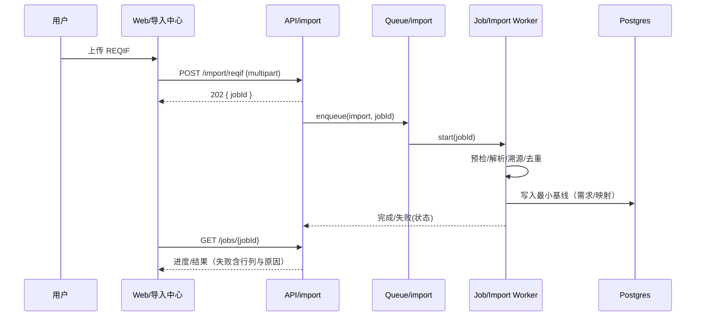
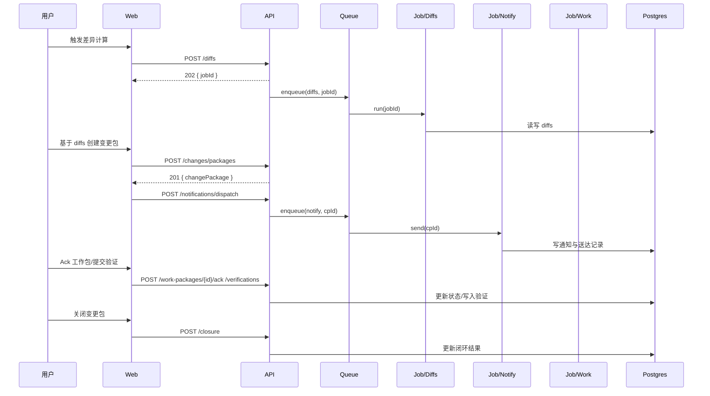

# 组件与流程（Components & Workflows）

## 组件清单（职责与边界）

1) Web（Next.js 14）
- 模块：工作台/导入中心/需求/指标/RBOM/变更/回归/集成/审计/系统设置
- 服务层：统一使用 `packages/api-client`，错误与重试策略在拦截器实现
- 表格：TanStack Table（服务端分页/排序/过滤）；列级权限由服务端裁剪

2) API（NestJS 10）
- 层次：Controller（IO/DTO）→ Service（业务）→ Repository（Prisma）
- 模块：import、mapping、metrics-extraction、rbom-binding、diffs、changes、notifications、verifications、meta-requirements、exports
- 中间件/守卫：Auth（JWT/Supabase）、RBAC/列级权限、Error Filter、RequestId/Tracing

3) Jobs/Workers（BullMQ）
- 队列：`import`, `extract`, `diffs`, `notify`, `regression`, `export`
- 任务：REQIF/SRS 导入→预检/解析/溯源/预览/落库；指标抽取（规则/正则/词典/LLM）→复核→入库；差异生成；通知派发；回归批次构建；导出（治理：审批/水印/脱敏）

4) 适配器（Adapters）
- `doors-adapter`：REQIF 解析 + DXL 客户端（Mock/Real 可切换）
- `notifications-adapter`：站内信/OA 通知（合并、静默时间窗）

5) 存储与契约
- Postgres（Prisma）+ Redis（Upstash）+ DuckDB（临时/就地分析）+ Supabase Storage（附件/导出）
- OpenAPI 契约 `/api/__openapi.json` + 生成 `packages/api-types`/`api-client`

6) 共享包
- `packages/shared`：类型/常量/工具；`packages/config`：工程规范与配置

## 关键接口（Key Interfaces）
- Web ↔ API：通过生成客户端调用（统一错误模型/分页/筛选/排序约定）
- API ↔ Jobs：服务内发布任务到队列，幂等 + 超时/重试 + 死信策略
- Jobs ↔ 适配器：抽象接口 + Mock/Real 双实现，配置开关与熔断
- 导出治理：服务端列级权限、审批阈值（>5k）、水印/脱敏、审计日志

## 组件关系图（Mermaid）
```mermaid
graph TB
  subgraph Web
    W1[导入中心]
    W2[需求/指标/RBOM]
    W3[变更/回归]
    W4[集成/审计/系统]
  end
  W1 -->|API Client| API[(REST API)]
  W2 -->|API Client| API
  W3 -->|API Client| API
  W4 -->|API Client| API

  subgraph Backend
    API --> SVC[Services]
    SVC --> Q[Queues(BullMQ)]
    SVC --> DB[(Postgres)]
    SVC --> RED[(Redis)]
    SVC --> DDB[(DuckDB)]
  end

  Q --> J1[Import]
  Q --> J2[Extract]
  Q --> J3[Diffs]
  Q --> J4[Notify]
  Q --> J5[Regression]
  Q --> J6[Export]

  J1 --> AD1[DOORS 适配器]
  J4 --> AD2[通知适配器]

  API --> O11[OpenAPI]
  API --> M11[/metrics]
```

## 核心流程（序列图）

1) REQIF 导入最小闭环


2) 差异→变更→通知→Ack→验证→闭环


---
