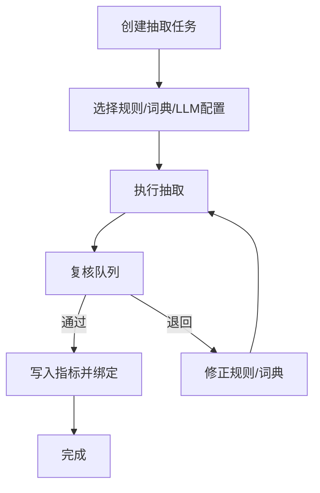
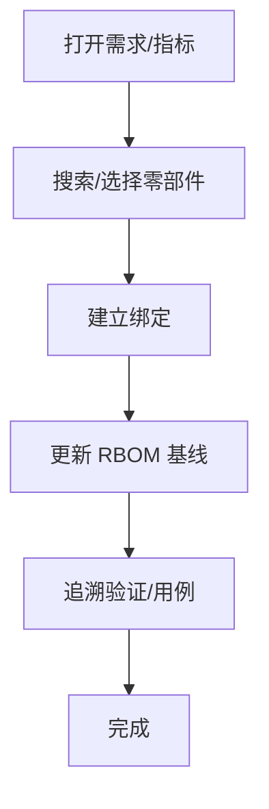
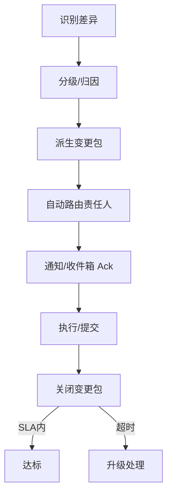
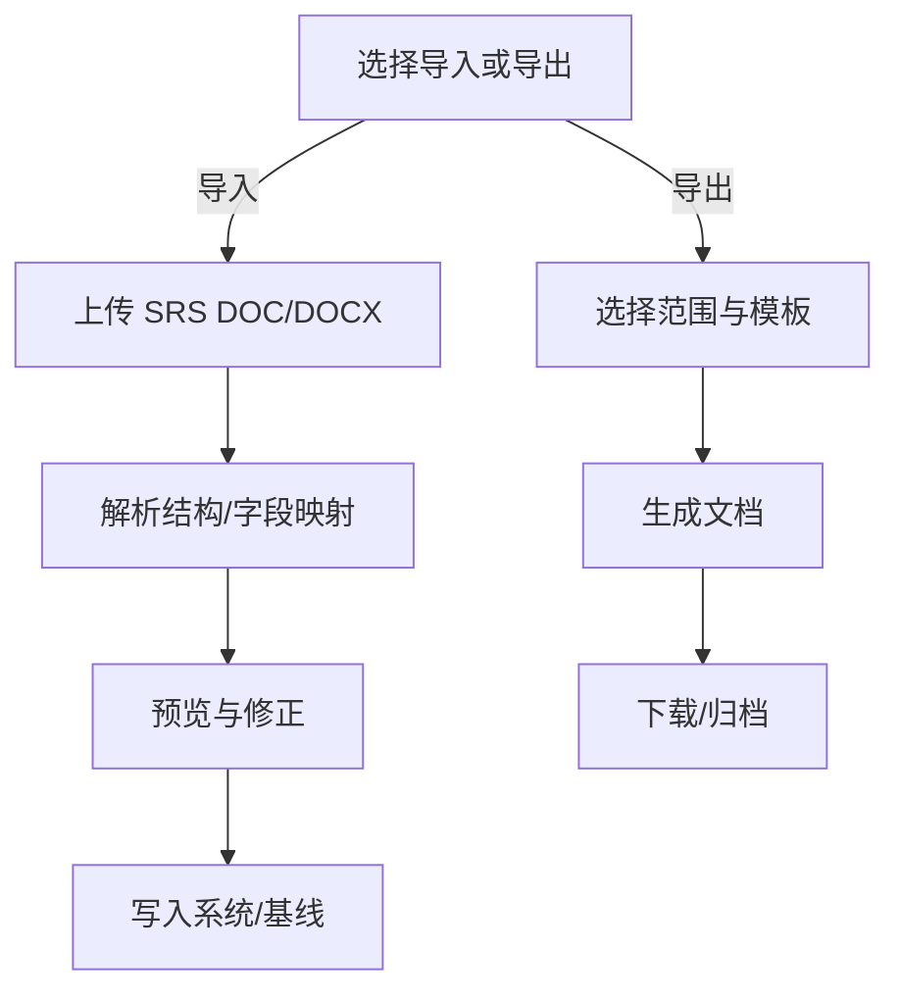

 # CDM 需求集成 MVP UI/UX Specification

 ## Introduction
 本文件基于《PRD：CDM 需求集成 MVP》（docs/prd.md）与项目简介（docs/brief.md）整理，旨在定义本系统的用户体验目标、信息架构、关键用户流与视觉规范，为后续的视觉设计与前端实现提供一致、可追溯的依据。

 本规范面向使用 DOORS 的工程团队：帮助他们以最小成本完成需求导入、结构管理、指标抽取、RBOM 绑定、变更与回归闭环，并确保端到端的可演示、可复核与可追溯。

 > 说明：本文件将采用交互式方式逐节完善；带有“需澄清/征询”的章节会暂停并进行 1-9 选项的需求澄清后再落稿。

## Change Log
| Date       | Version | Description                 | Author |
|------------|---------|-----------------------------|--------|
| 2025-09-22 | 0.16    | 新增：AI 提示词与 Lovable 多步指令引用 | UX     |
| 2025-09-22 | 0.15    | Nice-to-have：图标映射/术语/深链/Diff 细化 | UX     |
| 2025-09-22 | 0.14    | Medium 优先修订：表格可达性/快捷键、导出治理、i18n、暗色/高对比、作业化任务 | UX     |
| 2025-09-22 | 0.13    | PRD 对齐：IA/Flows 扩充；术语调整；Checklist 节 | UX     |
| 2025-09-22 | 0.12    | 新增：Next Steps 与交接清单 | UX     |
| 2025-09-22 | 0.11    | 新增：性能与设计策略        | UX     |
| 2025-09-22 | 0.10    | 新增：动效与微交互          | UX     |
| 2025-09-22 | 0.9     | 新增：响应式策略            | UX     |
| 2025-09-22 | 0.8     | 新增：可访问性要求          | UX     |
| 2025-09-22 | 0.7     | 新增：品牌与样式指南        | UX     |
| 2025-09-22 | 0.6     | 新增：组件库/设计系统建议    | UX     |
| 2025-09-22 | 0.5     | 新增：线框与视觉稿规划      | UX     |
| 2025-09-22 | 0.4     | 新增：用户流（草案）        | UX     |
| 2025-09-22 | 0.3     | 新增：信息架构与导航        | UX     |
| 2025-09-22 | 0.2     | 新增：总体 UX 目标与原则    | UX     |
| 2025-09-22 | 0.1     | 初始创建：标题与引言        | UX     |

 ## 总体 UX 目标与原则
 
 ### 目标用户画像
 - 需求工程师：导入/结构管理/编码与基线、追溯与查重
 - 验证/质量工程师：差异影响评估、回归批次与通过率、阻塞项
 - 变更与项目管理员：差异→更改单/包→路由→通知闭环与审计
 - 系统管理员：RBAC/视图/导出治理、审计与环境切换
 
 ### 价值流结构
 - 前置准备：DOORS 同步（原始→系统）→ 指标拆解 → 形成 RBOM（Part 级）
 - 主线流程（PRD 定义）：需求伴随/指标分配 → 对象/组件实现 → 验证
 - 支线流程：变更 → 差异 → 通知 → 回归（派生回归批次、看板透视）
 - 闭环补充：交付物与验证结果追溯 → DOORS 反写（MVP 用 Mock，预留真实端点）
 
 ### 可用性目标（体验向）
 - 首次 5 分钟上手：完成一次 REQIF 导入并形成可浏览的最小基线
 - 常用操作 ≤3 次点击；关键流“导入→浏览→追溯”≤8 步闭环
 - 操作反馈 <300ms；长任务提供进度与结果摘要
 - 导入有效文件失败率 <2%，错误定位到列/行并给出修复建议
 - 键盘可达覆盖 ≥95%；A11y 达到 WCAG 2.1 AA
 
 ### 业务度量（KPI 示例）
 - 需求实现率（按 PTR 阶段）：各 PTR 阶段“已验证通过系统需求 / 当期计划系统需求”
 - 变更闭环及时率：差异产生→变更包关闭在 SLA 内的比例（分级：高/中/低）
 - 回归通过率：按 RBOM 层级/批次统计通过率与阻塞项占比
 - 同步完整性/延迟：DOORS 同步覆盖率与端到端延迟（目标：覆盖≥X%，延迟≤Y 小时）
 - 通知达成率：送达/阅读/确认比例（合并通知单独统计）
 - TTV（Time-to-Value）：首次导入到形成可追溯最小基线的中位时间
 
 ### 设计原则
 - 清晰优先（对齐 DOORS/域语言）｜渐进披露（阶段化呈现）｜一致模式（列表-筛选-详情-操作区）
 - 立即反馈（可见状态与可追踪结果）｜默认可达（A11y/键盘优先）
 - 审计与安全（RBAC/列级导出控制/水印默认）｜数据密集友好（虚拟滚动、服务端筛选/分页、列配置持久化）
 
说明：以 PRD 的“主链路”为骨干组织 IA 与导航，支线承接变更与回归闭环；体验目标与业务 KPI（含 PTR 维度）并列，用于对齐跨角色验收与迭代节奏。

## 信息架构（IA）

### Site Map / Screen Inventory

```mermaid
graph TD
    A[工作台/总览] --> B[导入中心]
    A --> C[需求]
    A --> D[指标]
    A --> E[RBOM]
    A --> F[变更]
    A --> G[回归]
    A --> H[集成（导入/同步/反写/SRS）]
    A --> I[审计/导出]
    A --> J[系统设置]
    C --> C1[模块/层级浏览]
    C --> C2[列表/筛选]
    C --> C3[详情/追溯]
    C --> C4[基线/版本]
    C --> C5[编码规则]
    D --> D1[抽取任务]
    D --> D2[词典/规则]
    D --> D3[复核队列]
    D --> D4[标杆对比]
    D --> D5[型谱选用]
    E --> E1[绑定视图]
    E --> E2[基线对比]
    F --> F1[差异]
    F --> F2[更改单/变更包]
    F --> F3[路由策略]
    G --> G1[回归批次]
    G --> G2[看板/报告]
    H --> H1[REQIF 导入]
    H --> H2[DXL Mock 同步]
    H --> H3[DOORS 反写]
    H --> H4[SRS 导入/导出（DOC/DOCX）]
    I --> I1[操作审计]
    I --> I2[导出治理/水印]
    J --> J1[RBAC]
    J --> J2[视图/列模板]
    J --> J3[环境配置]
    J --> J4[元模型/字段配置（需求条目）]
```



### Navigation Structure

- Primary：工作台、需求、指标、RBOM、变更、回归、集成、审计、系统
- Secondary（示例）：
  - 需求：模块/层级、列表、详情、基线、编码规则、导入/同步
  - 指标：抽取任务、词典/规则、复核队列
  - RBOM：绑定视图、基线对比、追溯
  - 变更：差异、更改单/变更包、路由
  - 回归：批次、看板、报告
  - 指标：抽取任务、词典/规则、复核队列、标杆对比、型谱选用
  - 集成：REQIF 导入、DXL Mock 同步、DOORS 反写、SRS 导入/导出
  - 审计：操作日志、导出治理
  - 系统：RBAC、视图/列模板、编码规则、元模型/字段配置、环境

### Breadcrumb 策略

- 按域上下文分层（如 需求 > 模块 > 列表 > 详情）
- 详情页提供返回上层的稳定锚点，保持模块上下文
- 对长流程保持路径可见与可恢复，减少跨域跳转

## 用户流（草案）

### REQIF 导入最小闭环

**用户目标：** 成功导入 REQIF 并形成可浏览的最小基线与追溯

**入口：** 工作台→导入中心；需求→导入/同步；快捷入口（空态CTA）

**成功判据：** 通过校验并写入最小基线；在需求模块可浏览；生成最小追溯；错误零未处理

```mermaid
graph TD
    S[上传 REQIF 文件] --> V[格式/字段校验]
    V -->|通过| P[解析模块/层级]
    V -->|失败| E[错误详情(行/列/原因)]
    P --> DUP[溯源/查重]
    DUP --> W[导入预览]
    W --> C[提交写入最小基线]
    C --> T[生成最小追溯]
    T --> D[完成]
    E --> F[修复并重试]
```

- Edge Cases & Error Handling:
  - 非法/损坏 REQIF、编码问题、超大文件分片/超时
  - 模块/层级缺失或版本冲突、重复导入策略
  - 字段映射缺失（标题/内容/ID），给出修复向导
  - 去重策略：合并/跳过/新建；保留溯源（来源ID/哈希）并出具差异报告
  - 权限/配额限制（导入频率/大小）

**Notes：** 长任务采用作业化并显示进度；失败可定位到具体行/列并提供修复建议。

---

### 指标抽取与复核

**用户目标：** 从原始/系统需求中抽取指标，复核并落库绑定

**入口：** 指标→抽取任务；需求详情→抽取；批量操作

**成功判据：** 通过复核的指标入库且具备单位/量纲一致性，建立追溯



- Edge Cases & Error Handling:
  - LLM 置信度低/冲突；词典缺项；正则误匹配
  - 单位/量纲冲突、范围/阈值越界
  - 指标去重/合并策略与溯源

**Notes：** 复核界面提供差异高亮、置信度、来源片段与一键修正规则的回路。

作业化与恢复
- 取消：中止当前批次但保留已复核结果；提供“重新开始/继续”入口
- 重试：失败条目可批量重试；支持部分规则修正后重放
- 断点续跑：长批次支持从上次检查点继续；进度与耗时估算可见
- 通知联动：失败/完成/等待输入时触发站内信；可合并与静默时间窗

---

### RBOM 绑定（Part 级）

**用户目标：** 将需求/指标绑定至零部件，更新 RBOM 基线并保持追溯

**入口：** RBOM→绑定视图；需求/指标详情→绑定

**成功判据：** 产生有效绑定、基线更新成功、追溯链路完整



- Edge Cases & Error Handling:
  - 多义/歧义匹配（需要人工确认）
  - 缺失 RBOM 数据源或权限不足
  - 循环/无效绑定阻断基线更新

**Notes：** 支持批量绑定与撤销；提供基线差异视图。

---

### 支线：差异→变更包→路由→通知→SLA 关闭

**用户目标：** 将差异闭环为在 SLA 内关闭的变更包

**入口：** 变更→差异；需求/指标/绑定变动触发；审计提醒

**成功判据：** 变更包按分级路由至责任人并在 SLA 内关闭，审计记录完整



- Edge Cases & Error Handling:
  - 责任人缺失/冲突路由、跨团队协同
  - 通知聚合/降噪策略与未 Ack 追催
  - 依赖外部交付导致 SLA 风险的预警与豁免

**Notes：** 看板显示通过率/阻塞项；通知与审计默认开启水印与最小可见字段导出。

---

### 标杆对比与型谱选用

**用户目标：** 选择标杆数据集，完成指标对比，识别风险并完成型谱选用与记录

**入口：** 指标→标杆对比 / 型谱选用；工作台卡片“标杆差距与推荐”

**成功判据：** 完成对比报告与Top‑N推荐；选用结果记录并可追溯至需求/指标；风险项生成待办

```mermaid
graph TD
    S[选择标杆数据集] --> M[选择对比指标集]
    M --> C[计算对比/差距]
    C --> R[生成对比报告/风险清单]
    R --> P[选择型谱(Top‑N 推荐)]
    P --> J[记录选用结果/理由]
    J --> L[联动RBOM/需求风险待办]
    L --> D[完成]
```

- Edge Cases & Error Handling:
  - 指标口径不一致/缺失映射；单位/量纲冲突
  - 推荐置信度低；Top‑N 阈值配置与解释
  - 结果回写失败（权限/网络）；生成离线报告

**Notes：** 报告可导出；对比图表可筛选维度；推荐理由透明可解释。

---

### SRS 导入/导出最小闭环（DOC/DOCX）

**用户目标：** 导入 SRS 文档或从系统导出 SRS 草稿

**入口：** 集成→SRS 导入/导出；需求模块操作区

**成功判据：** 导入成功并映射字段/结构；导出成功并包含必要附录（追溯/变更摘要）



- Edge Cases & Error Handling:
  - 模板/样式兼容性；段落/表格解析失败
  - 字段映射缺失；文档过大分段处理
  - 权限限制与导出水印策略

**Notes：** 支持模板管理与文档样式配置；导入保留溯源与变更摘要。

---

## 线框与视觉稿

### Primary Design Files

**设计工具与位置：** Figma（链接：TBD）

说明：建议设为团队可编辑、其他人可查看；在页面描述中维护版本号与更新时间。

### Key Screen Layouts

1) 工作台/总览
- 目的：快速恢复上下文，展示核心 KPI 与最近活动（航空发动机领域）
- 关键元素：指标卡片（起飞推力达标率%、巡航 TSFC 达标率%、排放达标项数、地面试车通过率%）、最近任务与作业进度、快捷入口（导入/复核/RBOM/差异）
- 交互要点：卡片可点击深链；空态提供引导 CTA
- 设计文件引用：TBD

2) 导入中心（REQIF）
- 目的：完成文件上传、字段校验、预览与写入最小基线
- 关键元素：拖拽区、字段映射提示、错误列表（行/列/原因）、去重与溯源提示、预览表、写入确认
- 交互要点：长任务作业化进度、失败可定位与复试、破坏性操作二次确认、查重冲突解决（合并/跳过/新建）
- 引用：TBD

3) 需求列表/筛选
- 目的：高效检索与批量操作
- 关键元素：列模板与密度切换、服务端筛选、保存视图、批量操作、虚拟滚动、固定列
- 交互要点：键盘快捷键、可配置列持久化、空态/边界态信息清晰
- 引用：TBD

4) 需求详情/追溯
- 目的：聚合字段/版本/溯源与关联对象
- 关键元素：头部（ID/状态/负责人）、Tab（内容/追溯/版本/活动/查重冲突）、右侧操作区
- 交互要点：面包屑稳定返回；追溯链路可视化
- 引用：TBD

5) 指标复核队列
- 目的：逐条/批量复核抽取结果
- 关键元素：左右分栏（来源片段 vs 抽取结果）、置信度、差异高亮、批准/退回
- 交互要点：一键修正规则回路、批量通过、冲突提示
- 引用：TBD

6) RBOM 绑定视图
- 目的：需求/指标与零部件的快速绑定与基线更新
- 关键元素：左树（RBOM）、右表（候选/已绑定）、搜索、建议绑定、基线对比
- 交互要点：批量绑定与撤销、冲突处理
- 引用：TBD

7) 变更差异列表
- 目的：收敛差异并派生更改单/变更包
- 关键元素：按级别/来源分组、责任人、路由策略、SLA 计时、审计
- 交互要点：聚合/降噪、未 Ack 追催
- 引用：TBD

8) 回归看板
- 目的：按 RBOM 层级与批次展示通过率与阻塞项
- 关键元素：按层级汇总、趋势、阻塞清单、过滤
- 交互要点：从看板深链至具体失败用例/对象
- 引用：TBD

---

## 组件库 / 设计系统

### 设计系统取向（建议）

**数据密集型企业风格（Ant-like）**：优先信息密度、表格/筛选/表单能力与可配置性，主题令牌易于治理；适配本项目以桌面为主的工程场景。

Rationale：
- 数据密集：需要高性能表格（虚拟滚动/服务端分页）、可配置列与持久化视图。
- 长任务：反馈与进度组件完善；破坏性操作二次确认模式成熟。
- 可达性：易满足键盘可达与对比度要求；主题令牌可扩展暗色模式与品牌色。

### 核心组件清单（种子）

- 输入控件：Button、Input/TextArea、Select/MultiSelect、Number/Unit、Date/Time/DateTime、Checkbox、Radio、Switch
- 数据/导航：Table（虚拟滚动/服务端分页）、Tree/TreeTable、Tabs、Breadcrumb、Pagination、Tag/Badge、Tooltip/Popover
- 反馈：Toast/Notification、Alert、Modal/Drawer、Confirm、Progress、Skeleton/Empty、Spinner
- 布局：Grid、SplitPane、Responsive Container、右侧操作区框架（详情/操作）
- 领域组件：Import Wizard、Diff Viewer、Review Queue、RBOM Tree、Traceability Graph、Job Progress Panel

### Diff Viewer 交互细化

视图模式
- 对比方式：并排（side‑by‑side）与行内（inline）可切换；字段级与条目级双粒度
- 聚合与范围：按级别（高/中/低）与来源（导入/抽取/绑定/反写）分组；支持范围收敛（仅显示变更处）

过滤与定位
- 过滤：按对象类型/级别/责任人/时间窗口；支持关键字搜索与高亮
- 定位：导入后可通过“定位到新项/变化项”一键跳转；支持锚点链接与 URL 深链

批量操作与衍生
- 批量选择差异并一键派生更改单/变更包；提供预设路由策略与责任人建议
- 回滚/忽略策略：允许“忽略本次差异”并记录理由；支持回滚（具备权限且可逆时）

键盘与可达性
- 键位：`j/k` 上下、`o/Enter` 展开/收起、`/` 搜索、`f` 过滤、`a` 批量选择
- A11y：差异高亮具备可达性标签；颜色+形状双编码；支持 reduced-motion

性能与导出
- 虚拟滚动与分批渲染；大列表分页/分段加载
- 导出 Markdown/PDF（含水印与过滤摘要）；复制为片段（带上下文）

### 表格操作与可达性模式（Data‑Dense UX）

模式
- 选择模式：按 `Space` 或 `Shift+Click` 进入批量选择；顶栏浮出批量操作区；`Esc` 退出
- 列配置：列显隐/顺序/宽度持久化；提供“重置列”与“保存为视图”
- 虚拟滚动：稳定 `row key`，避免跳焦点；粘性表头与列
- 可达性：行/单元格均可聚焦；操作区外置且可键盘触达

推荐键位（可在帮助对话中展示）

| 操作 | 快捷键 |
|---|---|
| 全局搜索聚焦 | `/` |
| 进入/退出选择模式 | `Space` / `Esc` |
| 选中/取消当前行 | `Space` |
| 连续选择 | `Shift+↑/↓` |
| 跳页/跳首尾 | `PgUp/PgDn`，`Home/End` |
| 打开详情 | `Enter` |
| 批量删除/导出（示例） | `Cmd/Ctrl+Backspace` / `Cmd/Ctrl+E` |
| 列设置 | `Cmd/Ctrl+Shift+L` |
| 快捷键帮助 | `?` |

说明：具体键位以实现为准，需在帮助对话中可查；所有操作需存在等价的可见按钮以保证可发现性。

### 设计令牌（建议）

- 色彩：`primary/secondary/accent/success/warning/error/neutral*`（含对比度伴随色）
- 字体：`font.family`, `font.size.scale`, `font.weight`（中文优先可读性）
- 间距：`space.0…n`（4/8 基数）、`container.gap`
- 圆角与描边：`radius.*`、`border.color/width/style`
- 阴影与层级：`shadow.*`、`z.*`
- 动效：`motion.duration/speed/ease`（减少大型动效）

### 可达性与国际化基线

- WCAG 2.1 AA，对比度/焦点可见/键盘路径完整；可选“高对比度模式”。
- 国际化与本地化：中英文切换、数值/日期/单位格式化；可选 RTL 支持。

### 国际化细则（i18n 指南）

- 文案长度弹性：为英文/多语言预留 30–50% 扩展空间；按钮最小宽度与自适应截断策略
- 数字与单位：统一单位/量纲，通过词典（MDM）格式化；千分位与小数点本地化
- 日期与时区：ISO 存储、本地化显示，显式时区；相对时间需提供确切时间提示
- 复数与性别：使用 i18n 库处理 plural/gender 规则；避免字符串拼接
- RTL（可选）：布局、图标方向与动效镜像；仅在需要时开启并回归关键界面

---

## 品牌与样式指南

### Visual Identity

**Brand Guidelines：** TBD（若无现成规范，采用“中性企业风格 + 可配置品牌色”作为基线）。

### Color Palette

| Color Type | Hex Code | Usage |
|---|---|---|
| Primary | #2563EB | 主按钮/高亮/链接 |
| Secondary | #475569 | 次要按钮/分隔/标题弱化 |
| Accent | #F59E0B | 强调/重点提示/图表强调 |
| Success | #16A34A | 正向反馈/完成 |
| Warning | #F59E0B | 警告/重要提示 |
| Error | #DC2626 | 错误/破坏性操作 |
| Neutral | 灰阶 50–900 | 文本/边框/背景（确保对比度达标） |

### Typography

**Font Families**

- Primary: Inter, "PingFang SC", "Microsoft YaHei", Helvetica, Arial, sans-serif
- Secondary: "SF Mono", "JetBrains Mono", ui-monospace, monospace
- Monospace: 同 Secondary，用于代码/ID/技术字段

**Type Scale**

| Element | Size | Weight | Line Height |
|---|---|---|---|
| H1 | 24px | 600 | 32px |
| H2 | 20px | 600 | 28px |
| H3 | 18px | 600 | 26px |
| Body | 14px | 400 | 22px |
| Small | 12px | 400 | 18px |

### Iconography

**Icon Library：** Remix/IconPark/Feather（统一线性风格）

**Usage Guidelines：** 语义清晰、对比度达标、命中触达区域≥44px，状态颜色与语义色保持一致。

#### Domain Icon Mapping（建议）

| 对象/动作 | 图标建议 | 备注 |
|---|---|---|
| 需求（Requirement） | file-text / document | 与 SRS/文档区分颜色/标签 |
| 指标（Metric） | target / speedometer | 数值/单位相关语义 |
| RBOM/零部件 | tree / component | 层级/树结构含义 |
| 差异（Diff） | git-compare / diff | 用于变更/对比入口 |
| 更改单/变更包 | ticket / package | 工作项语义 |
| 回归/批次 | kanban / checklist | 看板/通过率语义 |
| 导入/同步 | upload/cloud-sync | 长任务作业语义 |
| 反写 | download/upload-cloud | 方向与导入区分 |
| 审计/导出 | shield-check / export | 治理/合规模块 |
| 编码规则 | hash / barcode | 规则/编码语义 |
| 词典/规则 | book / funnel-cog | 配置/规则语义 |

状态与颜色规范
- 成功/完成：使用 Success 色；错误/危险：使用 Error 色；警告：使用 Warning 色；信息：使用 Primary/Secondary
- Disabled：降低不透明度至 40–60%，保留形状但不使用语义色；保证与 Enabled 可区分
- 危险态按钮/操作：同时使用颜色+图标（如 trash/alert-triangle）+二次确认
- 尺寸：列表 16–20px；工具栏 20–24px；触屏 ≥24–32px（触达区≥44px）

### Spacing & Layout

**Grid System：** 12 列，最大容器宽 1280–1440px（桌面）；移动断点详见“响应式策略”。

**Spacing Scale：** 4/8 基数；提供密度切换（紧凑/标准）以适配数据密集界面。

### 暗色与高对比主题

- 主题切换：通过设计令牌启用 `theme.dark` 与 `theme.highContrast`；与品牌主色保持可读对比
- 颜色对照建议（示例）：

| 语义 | 明亮 | 暗色 | 高对比 |
|---|---|---|---|
| 背景 | #FFFFFF | #0B1220 | #000000 |
| 文字 | #0F172A | #E5E7EB | #FFFFFF |
| 主色 | #2563EB | #3B82F6 | #1E40AF |
| 分隔/边框 | #E2E8F0 | #1F2937 | #FFFFFF80 |
| 警告 | #F59E0B | #FBBF24 | #F59E0B |
| 错误 | #DC2626 | #F87171 | #DC2626 |

- 对比校验：所有文本/图标与背景在各主题下满足 WCAG 2.1 AA；高对比模式优先 7:1 目标
- 动效与阴影：暗色降低阴影强度、增加边框明度；高对比禁用大面积半透明

---

## Checklist Results

- UI/UX 清单执行情况：尚未执行（待与团队共同走查）
- 计划清单：
  - 信息架构一致性检查
  - A11y 快速巡检（axe/键盘/屏阅）
  - 性能预算与关键页面基线检查
  - 关键流可行性与边界态演练

落地检查清单（供开发执行）
- 路径：`docs/samples/checklists/dev_ux_landing_checklist.md`
- 内容：表格与可达性、导入作业化、深链、导出治理、i18n/主题、性能与观测、E2E/A11y/Storybook、RBAC/审计

---

## 可访问性（Accessibility）

### 合规目标

- 标准：WCAG 2.1 AA（建议目标）
- 模式：关键界面提供“高对比度模式”与可切换键盘优先提示

### 关键要求

**Visual（视觉）**
- 对比度：主要文本≥4.5:1，非文本 UI 元素≥3:1；密度切换不降低对比度
- 焦点指示：可见、与品牌色区分，焦点环≥2px，禁用状态不吞焦点
- 文本：根字号≥16px，支持缩放至200%页面不破版

**Interaction（交互）**
- 键盘：完整操作路径（上传、筛选、表格操作、复核、绑定、导出），提供“Skip to main”跳转
- 屏幕阅读器：语义结构（nav/main/section/table/breadcrumb/dialog），动态更新区使用 aria-live
- 触控：命中区域≥44px；表格支持行/单元格聚焦，复杂操作在外置操作区完成

**Content（内容）**
- 替代文本：图标/图表/状态均提供可读替代；含水印导出也提供可读标识
- 标题语义：H1–H3 层级清晰并与面包屑一致
- 表单：显式 label、错误联动提示、描述性帮助文本与示例

### 测试策略

- 自动化：axe/Pa11y/Storybook A11y 插件；CI 阶段阻断高严重度问题
- 手动：键盘走查、屏阅（NVDA/VoiceOver）、高对比度模式、200% 缩放
- 回归：为“导入、复核、绑定、差异闭环”等关键流建立 A11y 用例

---

## 导出治理（Export Governance）

### 范围与格式
- 支持格式：CSV、XLSX、Markdown、PDF（报告类）；默认最小可见字段
- 列级权限：遵循视图/列模板与 RBAC；敏感列默认隐藏且需审批解锁
- 行级过滤：导出仅包含当前筛选/权限可见的数据子集；支持审计留痕

### 水印与审计
- 水印：包含用户名、时间戳、会话ID、敏感字段计数；PDF/图片导出内嵌
- 审计：记录发起人、范围、列/行数、目的（可选）、导出结果与下载次数
- 频率限制：按用户/组织节流与配额；异常导出触发告警

### 映射与一致性
- 导出映射：字段名与显示名映射可配置；单位/量纲在导出时标准化
- 国际化：导出语言可选；日期/数字按所选区域格式化
- 可追溯：在导出文件尾部附上来源上下文与过滤条件摘要

---

## 追溯深链规范（Traceability Deep Links）

### 目标
- 允许从任何上下文一键跳转到特定对象（需求/指标/零部件/差异/变更包等）并保留来源上下文

### 标识与 URL 规范
- 稳定 ID：`ModuleID`, `ObjectID`, `BaselineID`（必要时包含 `SourceID`, `Hash`）
- URL 模式（示例）：
  - 需求详情：`/requirements/:objectId?module=:moduleId&baseline=:baselineId`
  - 指标：`/metrics/:metricId?source=:objectId`
  - RBOM：`/rbom/:partId?baseline=:baselineId`
  - 差异：`/diffs/:diffId?level=:severity&source=:moduleId`
- 上下文参数：`from=dashboard|list|report`, `q=`（搜索条件序列化），`view=`（列模板），`return=`（返回锚点）

### 行为与权限
- 默认同页打开；可选择新页打开但保留 `return` 参数以便返回
- 缺失/过期对象：展示“未找到/已移动”提示并提供溯源路径与最新对象链接
- 权限不足：显示最小信息与申请权限入口；审计记录尝试

### 复制与审计
- 提供“复制深链”与“复制简链”按钮；简链通过短链服务映射
- 审计：记录点击来源/目标对象/会话/结果（成功/失败）

---

## 响应式策略（Responsiveness）

### Breakpoints（建议）

- Mobile：0–767 px（移动纵向）
- Tablet：768–1023 px（横向平板/小笔记本）
- Desktop：1024–1439 px（标准桌面）
- Wide：≥1440 px（宽屏/大桌面）

### Adaptation Patterns

- Layout Changes：网格列数从 1→2→12 渐进；桌面保留“列表-详情-右侧操作区”，移动折叠为“列表→详情”的路由切换
- Navigation Changes：主导航收拢为抽屉或底部栏（移动）；二级导航改为顶部 Tabs 或分段控制
- Content Priority：移动优先展示“任务/状态/KPI/主要操作”，次要信息折叠到详情/抽屉；表格列按优先级裁剪并提供“更多列”查看
- Interaction Changes：表格在移动端卡片化；批量操作迁移至“选择模式”；悬停交互改为显式按钮/长按菜单

### Rationale

- 主战场为桌面数据密集场景；移动端聚焦查看/审批/通知/仪表板，避免复杂编辑
- 保持 IA 与主线价值流一致，通过令牌控制密度与断点样式，降低跨端心智负担

---

## 动效与微交互（Animation & Micro-interactions）

### Motion Principles

- 目的性优先：仅为表达层级、状态与因果关系服务，拒绝装饰性动效
- 短而一致：常规 120–240ms，模态/抽屉 180–260ms；统一令牌管理
- 非阻塞：动效不阻塞操作，可随时中断或跳过，支持并发反馈
- 连续性：元素位置/状态转换保持空间连贯，减少跳变
- 降噪：微幅、低位移、低透明度变化，避免过度注意力劫持
- 尊重偏好：遵循 prefers-reduced-motion，禁用非必要动效

建议令牌
- duration: xs=80ms, sm=120ms, md=200ms, lg=320ms, xl=600ms
- easing: standard=cubic-bezier(0.2, 0, 0, 1), emphasized=cubic-bezier(0.2, 0, 0, 1), decelerate=cubic-bezier(0, 0, 0, 1)

### Key Animations（建议清单）

- 导入流程进度：进度条填充+步骤切换（md 200ms, easing standard）；错误时轻微抖动替换为显式错误高亮（无抖动于 reduced-motion）
- 表格行悬停与可见操作：背景浅显提升 80–120ms；操作图标淡入 120ms
- Toast 通知：自底部/右侧轻推入场 180ms，停留 4–6s，离场 120ms
- 模态/抽屉：模态淡入+微缩放（scale 0.98→1.0, 180–220ms）；抽屉右侧滑入 220–260ms
- 骨架屏/Shimmer：线性 1200–1600ms；仅在加载>300ms 时显示
- 焦点与可见性：焦点环淡入 80ms；滚动聚焦 120ms，避免大幅平移动效
- 展开/收起：内容高度过渡 160–220ms；Chevron 旋转 120ms
- Diff 高亮：短暂背景高亮 600ms，随后渐隐；用于“导入后定位到新项”
- 标签/筛选 Chip：新增轻微放大+淡入 100–140ms；删除折叠 140–180ms
- 作业进度脉冲：进度环轻微脉冲 600ms 循环（reduced-motion 下改为静态进度）
- Tooltip：400ms 延迟后淡入 120ms，移动端改为显式点击/长按菜单

### A11y 与性能注意

- Reduced Motion：`@media (prefers-reduced-motion: reduce)` 下禁用/缩短动效，使用静态替代（无抖动、无大位移）
- 性能：仅动画 `opacity/transform`，避免 `top/left/height`；必要时使用 FLIP；`will-change` 谨慎使用
- 目标帧率：交互 60fps；长动效尽量 < 600ms；列表批量更新采用分批渲染

---

## 性能与设计策略（Performance）

### 性能目标（建议，可按阶段细化）

- 首屏可交互（TTI）：桌面缓存访问 ≤ 2.0s；首次访问 ≤ 3.5s（标准宽带）
- 交互响应：100ms 内出现可见反馈；常见操作 300ms 内完成；更长任务显示作业化进度
- 动画与滚动：交互场景 60fps，列表滚动稳定 60fps
- 资源预算（每路由）：JS ≤ 300KB gzip，CSS ≤ 120KB gzip，首屏图标/图片 ≤ 80KB，字体不超过 2 个子集
- 数据预算：首屏 API 并发 ≤ 3；关键接口 p95 ≤ 300ms；列表接口分页或流式返回

### 设计与实现策略

- 渲染与加载
  - 骨架屏与占位优先；按路由/组件代码分割与按需加载；预取“高概率下一步”（hover/视窗内）
  - 大组件（Diff Viewer、RBOM Tree、Traceability Graph）延迟挂载；空态先行
  - 图片与图标使用 SVG/矢量，图片延迟加载；字体按需子集化

- 表格与数据密集界面
  - 虚拟滚动、服务器分页/筛选/排序；粘性表头与列宽缓存
  - 批量选择进入“选择模式”，避免每行悬浮重排；稳定 row key，减少重渲染

- 计算与并发
  - 规则/词典/差异比对等重计算放至服务端或 Web Worker；前端保持主线程轻量
  - 长任务作业化（Job）+ 增量结果/进度推送；失败可恢复与断点续跑

- 网络与缓存
  - HTTP 压缩（br/gzip）、HTTP/2/3 复用、Keep-Alive；流式响应用于长任务状态
  - 静态资源 CDN 与强/协商缓存（ETag/Last-Modified）；stale-while-revalidate 策略
  - 客户端查询缓存与幂等操作；重试与退避策略

- DOM 与动画
  - 仅动画 opacity/transform，避免 top/left/height；必要时使用 FLIP 技术
  - 控制重排与重绘；减少深层嵌套与巨型 DOM；谨慎使用 `will-change`

- 可观测与预算治理
  - RUM 埋点：TTFB/TTI/INP/CLS/FCP；建立性能预算与告警阈值
  - 定期 Lighthouse/Profiler 巡检；关键页面建立性能基线与趋势跟踪

---

## Next Steps 与交接清单

### Immediate Actions

- 与 PM/PO 评审 UX 目标/KPI 与价值流结构
- 在 Figma 建立 8 个关键界面线框页并挂接本规范链接
- 选定组件库基线与设计令牌初版（品牌主色/灰阶/间距/动效）
- 建立 A11y/性能预算在 Storybook 或文档站中
- 与 Dev 对齐表格虚拟滚动与 Job 进度通道技术路线

### AI 辅助生成资料

- 主提示词 + Lovable 多步指令：`docs/samples/prompts/ai_frontend_prompt_and_steps.md`

### 样例与支撑资产

- 样例数据包：`docs/samples/data/`（含 REQIF、SRS 模板、Mock JSON）
- 键盘与可达性地图：`docs/samples/accessibility/keyboard_a11y_map.md`
- 导出治理矩阵模板：`docs/samples/governance/export_matrix.csv`
- 事件与观测字典：`docs/samples/observability/events_dictionary.md`
- 评审议程与材料包：`docs/ops/ux_review_agenda.md`，`docs/ops/ux_review_materials.md`
- 领域 Storybook 示例数据：`docs/samples/storybook/domain_samples.ts`
- i18n 样例：`docs/samples/i18n/zh-CN.json`，`docs/samples/i18n/en-US.json`

### Design Handoff Checklist

- 全部用户流与界面完成
- 组件清单与状态/变体说明齐备
- A11y 要求验证通过（自动+手动）
- 响应式断点与适配说明已实现
- 品牌与样式令牌产物交付（JSON/CSS 变量）
- 性能预算与观测点配置就绪

---

## 附录：术语与缩写（Glossary）

| 术语 | 全称/别名 | 说明 |
|---|---|---|
| REQIF | Requirements Interchange Format | DOORS 等工具的需求交换格式 |
| DOORS | IBM Rational DOORS | 需求管理系统 |
| RBOM | Requirements‑Bill of Materials | 需求与零部件的绑定清单/结构 |
| DXL | DOORS eXtension Language | DOORS 的脚本/扩展语言 |
| SRS | Software/Systems Requirements Specification | 需求规格说明书（文档） |
| PTR | Product Test/Trial Review（因组织而异） | 项目评审/里程碑分段（如 PTR0/1/2） |
| KPI | Key Performance Indicator | 关键绩效指标 |
| SLA | Service Level Agreement | 服务级别协议（时限/达标口径） |
| MDM | Master Data Management | 主数据管理/词典与口径治理 |
| LLM | Large Language Model | 大语言模型（用于抽取/辅助） |
| RBAC | Role‑Based Access Control | 基于角色的访问控制 |
| A11y | Accessibility | 可访问性 |
| i18n/l10n | Internationalization/Localization | 国际化/本地化 |
| TTFB | Time To First Byte | 首字节时间 |
| FCP | First Contentful Paint | 首次内容绘制 |
| INP | Interaction to Next Paint | 交互到下一次绘制 |
| CLS | Cumulative Layout Shift | 累积布局偏移 |
